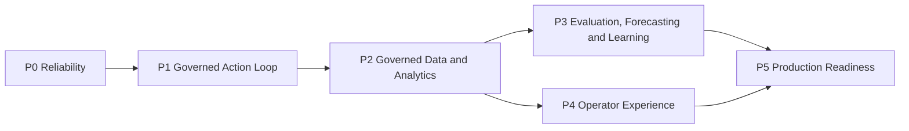

# GLAP Development Plan

This document defines where GLAP is going. It contains durable product
direction, capability tracks, ordering constraints, and entry gates. It does
not record daily work, workflow run IDs, temporary blockers, or completed-task
history.

Current implementation truth and the next executable slice live in
[`CURRENT_DEVELOPMENT_STATUS.md`](CURRENT_DEVELOPMENT_STATUS.md). Repository
authority and evidence rules live in [`AGENTS.md`](AGENTS.md).

## Product thesis

GLAP is a governed operational decision system for logistics disruption. It
should detect a material condition, explain exposure, recommend a bounded
response, preserve human authority, record execution and outcome evidence, and
measure whether each capability improves decisions.

The target system is:

```text
Reality / Historical Replay
  -> Operational Data
  -> Detect
  -> External Investigation
  -> Evidence
  -> Decision Memory
  -> Reason / Recommend
  -> Governed Human Authority
  -> Action
  -> Outcome
  -> Learning

Evaluation Harness surrounds the complete chain.
```

## Strategic principles

1. Deterministic safety rules remain explainable and cannot be silently
   replaced by a learned model.
2. Human approval remains mandatory for protected operational mutations.
3. Synthetic logistics evidence, deployed AWS evidence, and measured business
   outcomes are always distinguished.
4. Point-in-time decisions may use only evidence available at their cutoff.
5. A capability is valuable only when paired evaluation shows an attributable
   improvement in decision quality or business effect.
6. Simple baselines remain the benchmark until stronger approaches beat them
   on governed evidence.

## Delivery order



Evaluation is cross-cutting: it measures P1 through P5 rather than appearing as
one step in the business workflow.

## P0 — Reliability and truthful health

**Outcome:** scheduled and manual workflows fail closed, expose safe health
evidence, and never imply freshness after an upstream failure.

Durable capabilities:

- success-gated orchestration;
- freshness, completeness, duplicate, and abnormal-volume checks;
- safe per-stage status and failure categories;
- retry, DLQ, alarm, recovery, and runbook coverage;
- aggregate-only public health reporting.

Progression gate: controlled failure and recovery evidence must remain
inspectable without exposing private AWS identifiers.

## P1 — Governed Action and Outcome loop

**Outcome:** a signed-in human can review, edit, approve, reject, assign,
complete, and reconcile a bounded Action through immutable audit events.

Durable capabilities:

- authenticated viewer, operator, approver, and administrator boundaries;
- `approve/edit/reject/complete` operations with idempotency;
- immutable Action proposals and append-only state events;
- named owner and due-date assignment;
- observed Outcome reconciliation separated from expected impact;
- policy proposals that remain `PENDING_HUMAN_REVIEW`.

Progression gate: the staging assignment canary is complete only after a
response-fix release, stable same-request retry, and a different named human's
approval or rejection are reconciled. Any later `COMPLETE` and Outcome
generation require a new named-operator decision and preserve the same
immutable proposal and append-only audit boundary. This does not authorize
production.

## P2 — Governed operational data and analytics

**Outcome:** operators and evaluators consume stable, reconciled, temporally
truthful data contracts instead of ad hoc copies.

Durable capabilities:

- stateful multimodal shipment identity and lifecycle semantics;
- governed Iceberg views for operations, features, labels, and outcomes;
- explicit grain, owner, provenance, freshness, and reconciliation rules;
- aggregate-only public snapshot and private entity-level cockpit boundary;
- plan-first cost, refresh, retention, and maintenance controls.

Progression gate: AWS cost or maintenance controls require separate human
infrastructure approval and measured query baselines.

## P3 — Evaluation, forecasting, and learning evidence

**Outcome:** GLAP can show which capability changed a decision, whether the
change was reasonable at the time, and eventually whether it improved a
business outcome.

Durable capabilities:

- four evaluation layers: System Correctness, Capability Attribution,
  Decision Quality, and Business Outcome Effect;
- versioned, paired, read-only counterfactual experiments;
- Historical Replay with frozen cutoffs and reveal isolation;
- capability-neutral blinded Decision Quality review;
- simple forecast baselines and governed label-readiness gates;
- learning proposals that cannot self-activate.

Near-term gate: the four-review Decision Quality minimum is complete, and the
independent pre-specified A303 synthetic robustness run is complete with a
`NOT_ROBUST` result. Two bounded post-hoc A303.v2 eligibility guardrails have
also failed an anti-abstention development gate: one retains only two action
opportunities at 86.42% non-negative on its action subset, and the stricter one
retains none. On `2026-08-22`, the human project owner selected stop/retire;
A303.v1 threshold tuning, holdouts, prospective collection, calibration,
activation, and production progression are now closed. All evidence remains
preserved. Further threshold tuning on the same corpus is not a durable
progression path. Any fundamentally new rule would require separate explicit
human authorization, a new version, a newly frozen holdout, and the full
attributed-change and negative-control robustness design. Only after a future version passes its
synthetic gate may the project seek at least three
independently governed actual-calendar baseline observations and three
`PROSPECTIVE_CONTROLLED` treatment pairs. Historical factual reveals may
calibrate only observed baselines; simulated staging Outcomes and unit-test
records are ineligible for treatment-effect, readiness, policy, or promotion
claims.

Model gate: supervised training remains blocked until every relevant provider
has sufficient `OPERATIONAL` / `ACTUAL_CALENDAR` closed labels and a candidate
consistently beats the governed simple baseline.

## P4 — Internal operator experience

**Outcome:** an authenticated operator can move from risk to evidence, decision,
Action, Outcome, and audit history without crossing authority boundaries.

Durable capabilities:

- risk hotspots and network drill-down;
- Decision Queue and governed Action Board;
- Outcome Review, Pipeline Health, and Forecast Accuracy;
- accessible loading, empty, stale, denied, conflict, and recovery states;
- evidence and authority shown at the point of decision.

Progression gate: new investigation or agent experiences must reuse governed
tools and authority rather than introducing direct operational writes.

## P5 — Governance and production readiness

**Outcome:** the platform is supportable, cost-controlled, recoverable,
auditable, and eligible for a separate human production decision.

Required evidence:

- least-privilege IAM and data access;
- query budgets, retention, compaction, and orphan cleanup;
- SLO, cost, audit, lineage, and incident evidence;
- load, concurrency, security, and failure-injection testing;
- rollback-ready versioned policies and models;
- representative evaluation evidence with explicit limitations.

Passing these gates does not itself authorize production aliases, recurring
schedules, policy activation, model promotion, or operational writes.

## Long-term extension path

After the Historical Replay benchmark is frozen, evaluate additional paired
variants using the same scenario, tools, evidence, seed, and authority:

- internal operational data only;
- plus governed External Evidence;
- plus Decision Memory;
- plus an Investigation Agent;
- different agent hosts behind one Agent Runtime Interface.

Agent hosts remain replaceable. GLAP owns the governed capabilities, evidence,
authority, action contract, and evaluation method.
