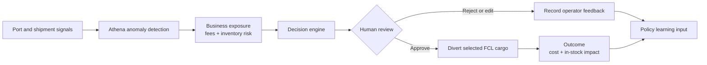
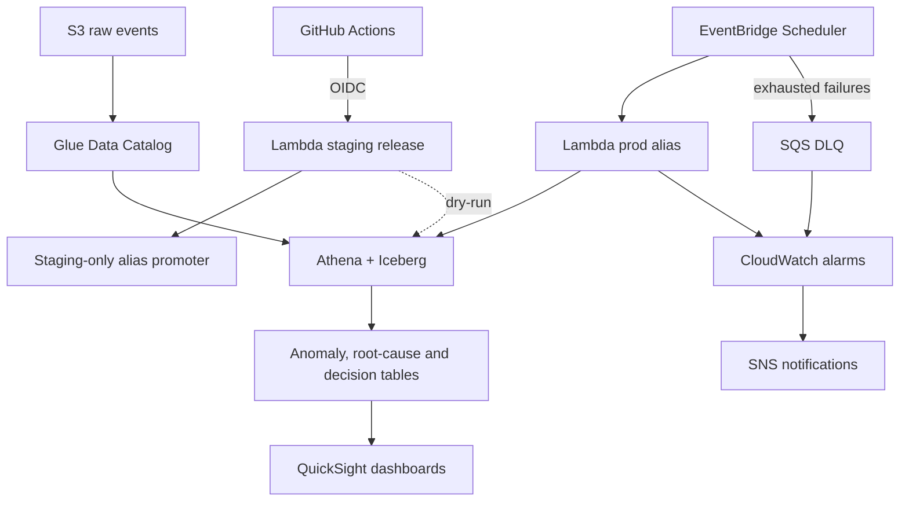

# GLAP: Logistics Decision Intelligence on AWS

[](https://github.com/Andy-JunXiong/GLAP-AI-Decision-Platform/actions/workflows/ci.yml)

GLAP turns logistics disruption signals into traceable operational decisions. It
detects abnormal shipment or port conditions, explains the business exposure,
recommends an action, and retains the result for review and later learning.

> **Project status:** AWS-deployed reference implementation, validated with
> synthetic logistics data. Runtime and deployment evidence is real; scenario
> costs and business outcomes are explicitly labelled synthetic.

## 60-second case: avoid port storage fees and a stockout

A destination port is already congested when a labour-strike signal raises the
probability of a longer disruption. Twelve inbound FCL containers carry a
critical SKU, but available inventory covers only eight days.

| Decision input | Synthetic scenario value |
| --- | ---: |
| Port congestion index | `0.87` vs `0.35` baseline |
| Strike probability | `82%` |
| Expected port dwell | `9 days` |
| Free storage time | `3 days` |
| FCL containers exposed | `12` |
| Storage fee | `AUD 220 / container / day` |
| Inventory cover | `8 days` |
| Estimated no-action storage exposure | `AUD 15,840` |

**GLAP recommendation:** divert eight high-priority containers to Melbourne,
then move them to the Sydney distribution centre by rail or truck. Keep four
containers on the original route and review the disruption daily.

In the synthetic validation outcome, the reroute prevents an inventory stockout
and reduces the modelled storage exposure by `AUD 5,760` after reroute cost. This
is a demonstration of decision logic, not a measured production saving.

[Read the complete decision case](docs/case_study_port_disruption.md) ·
[Open the sample inputs and outputs](samples/port_disruption_signal.csv) ·
[Try the private interactive decision brief](https://glap-port-decision.maki83794676.chatgpt.site)

## From signal to action



The system is designed to support an operator, not silently replace one. High-
priority recommendations remain reviewable and every decision can be traced to
its source metrics.

## Verified engineering evidence

| Capability | Verified status |
| --- | --- |
| AWS lakehouse | S3, Glue Catalog, Athena and Iceberg deployed |
| Decision orchestration | Python 3.14 Lambda deployed and smoke-tested |
| Scheduling and recovery | EventBridge Scheduler, two retries and encrypted SQS DLQ |
| Monitoring | CloudWatch alarms with SNS alarm and recovery notifications |
| Automated tests | Python 3.13 and 3.14 GitHub Actions CI |
| Versioned delivery | immutable Lambda versions with `staging` and `prod` |
| AWS authentication | GitHub OIDC; no long-lived deployment key |
| Staging safety | dry-run validation and staging-only alias promoter |

One measured reliability improvement reduced a duplicate-only scheduled run from
approximately **55.37 seconds to 2.34 seconds**. The synthetic data generator is
configured for roughly **400–500 shipments per day**.

See [AWS implementation evidence](docs/aws_implementation_evidence.md) and
[infrastructure boundaries](INFRASTRUCTURE.md) for the exact claims and limits.

## Current AWS architecture



[View the architecture with trust boundaries](docs/architecture_current.md).

## Why this design

- **Lakehouse:** shipment schemas and decision artifacts evolve; Iceberg provides
  ACID tables and schema evolution on S3.
- **Deterministic decision logic:** operational recommendations remain
  explainable, testable and auditable.
- **Human review:** expensive actions such as port diversion require an operator
  decision and can capture edits or rejection reasons.
- **Versioned delivery:** `$LATEST` is only a candidate; `staging` is validated
  before an approved version can move to `prod`.
- **Extension path:** Bedrock can later assist with explanation and policy
  refinement without replacing deterministic safety rules.

## Explore the project

- [Port disruption case study](docs/case_study_port_disruption.md)
- [Current AWS architecture](docs/architecture_current.md)
- [Versioned deployment workflow](docs/deployment_workflow.md)
- [Technical implementation](docs/GLAP_Technical_Implementation.md)
- [Decision flywheel evidence](docs/decision_flywheel_evidence.md)
- [QuickSight detection dashboard](docs/ai_detection_dashboard.png)
- [QuickSight decision dashboard](docs/ai_decision_dashboard.png)
- [QuickSight operations dashboard](docs/ai_ops_dashboard.png)
- [QuickSight learning dashboard](docs/ai_learning_dashboard.png)

## Repository map

```text
lambda/    deployed and deployment-support Lambda source
sql/       Athena/Iceberg DDL, orchestration and validation queries
tests/     unit tests for orchestration, dry-run and alias promotion
samples/   synthetic safe data and end-to-end decision examples
docs/      architecture, case studies, dashboards and evidence
examples/  simplified teaching examples
```

## Evidence boundaries

- All public shipment records, disruption scenarios and outcomes are synthetic.
- AWS runtime, version, CI/CD and reliability claims are based on inspected
  deployed resources and recorded runs.
- Estimated fees and avoided costs are scenario calculations, not production
  financial results.
- Current decision generation is deterministic and explainable; autonomous model
  learning and measured production impact are future capabilities.

## Author

Portfolio project focused on AWS lakehouse architecture, serverless reliability,
and practical decision intelligence for logistics operations.
