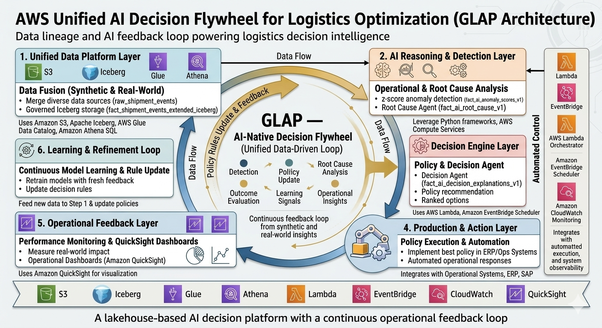

# GLAP: AI-Native Logistics Decision Intelligence on AWS

GLAP is an AWS-deployed reference implementation showing how a logistics team can move from passive reporting to a decision workflow that detects shipment anomalies and recommends traceable actions. It was built and validated with synthetic logistics data.


> **Project nature:** GLAP is a data-platform project whose primary implementation artifacts are Athena/Iceberg SQL, Lambda orchestration, infrastructure design, and QuickSight dashboards. Deployed implementation evidence is available in [`lambda/`](lambda/), [`sql/`](sql/), and [`INFRASTRUCTURE.md`](INFRASTRUCTURE.md); simplified teaching material remains in [`examples/`](examples/).

**Quantified evidence from existing project materials:** the synthetic operations layer was designed to simulate roughly **400 to 500 shipments per day** for downstream Athena analysis and decision workflows. If you want a production KPI claim here later, replace this with measured runtime or business impact from actual system logs.

## What Problem This Solves

Traditional logistics dashboards tell operators that service levels slipped after the fact. They do not close the loop from signal to action.

GLAP is designed to solve that gap:

- detect abnormal route or carrier behavior
- explain likely causes in operational language
- recommend a concrete action with priority
- write the result back into AWS tables for dashboarding and later learning

The business value is not "more charts." The value is faster and more traceable operational decisions on top of the same shipment data.

## Evidence of AWS Implementation

This repository separates deployed evidence from representative examples. Evidence labels and deployment boundaries are documented in [INFRASTRUCTURE.md](INFRASTRUCTURE.md).

### Architecture Evidence

- `Amazon S3` stores raw and curated logistics data
- `Apache Iceberg` provides ACID table management on the lakehouse
- `AWS Glue Data Catalog` manages table metadata
- `Amazon Athena` runs serverless SQL for anomaly detection and write-back
- `AWS Lambda` orchestrates the anomaly to decision pipeline
- `Amazon EventBridge Scheduler` triggers the workflow daily
- `Amazon QuickSight` surfaces outputs in operational dashboards

### Named Assets and Artifacts

- Architecture diagram: [docs/architecture.png](docs/architecture.png)
- Technical implementation notes: [docs/GLAP_Technical_Implementation.md](docs/GLAP_Technical_Implementation.md)
- Daily build journey: [docs/GLAP_Day1_to_Day20_README.md](docs/GLAP_Day1_to_Day20_README.md)
- Deployed Lambda source (sanitized): [lambda/glap_ai_agent_orchestrator.py](lambda/glap_ai_agent_orchestrator.py)
- Observed Athena queries: [sql/](sql/)
- Infrastructure and evidence status: [INFRASTRUCTURE.md](INFRASTRUCTURE.md)
- AWS verification manifest: [docs/aws_implementation_evidence.md](docs/aws_implementation_evidence.md)
- Versioned deployment workflow: [docs/deployment_workflow.md](docs/deployment_workflow.md)
- Representative Athena query: [examples/anomaly_detection.sql](examples/anomaly_detection.sql)
- Representative Lambda snippet: [examples/lambda_orchestrator.py](examples/lambda_orchestrator.py)
- Representative decision rules: [examples/decision_logic.py](examples/decision_logic.py)

### Examples of Concrete AWS Usage

- Athena queries aggregate shipment metrics and calculate z-score based anomalies
- Lambda polls Athena, parses results, applies root-cause and decision rules, and writes deduplicated records to S3-backed Iceberg tables
- QuickSight dashboards read decision outputs such as anomaly counts, action priority, and top problem routes

## Decision Flywheel Evidence

GLAP includes a synthetic decision-flywheel validation path rather than evidence of measured production outcomes.



One synthetic but realistic lifecycle is documented below and in [docs/decision_flywheel_evidence.md](docs/decision_flywheel_evidence.md).

| Stage | Evidence |
| --- | --- |
| Anomaly | `DEHAM->AUSYD / MAERSK` shows `avg_leg_duration_days` materially above baseline |
| Detection | Athena query flags the route with a high z-score |
| Decision | Decision logic marks the issue as `HIGH` priority and recommends carrier investigation |
| Action | Ops team reviews lane performance and expedites affected shipments |
| Outcome | Follow-up output records whether breach rate and transit time improved |
| Learning | Outcome tags can later tune thresholding, rules, or model prompts |

This demonstrates how an end-to-end operational loop can be tested with synthetic outcomes. It does not claim measured business impact.

## Why This Design

### Why a Lakehouse Instead of a Traditional Warehouse

The project uses an S3 plus Iceberg plus Athena pattern because the workload mixes raw operational data, evolving schemas, and iterative AI outputs. A traditional warehouse would be fine for static BI, but less natural for low-friction ingestion, table evolution, and storing intermediate AI artifacts such as anomaly scores, root causes, and decisions.

### Why a Decision Flywheel

A dashboard helps humans inspect the past. The designed decision flywheel extends this into action and outcome tracking. In the current public evidence, this learning path is validated with synthetic outcomes.

### AI's Role in the System

AI here is deliberately practical. It is not positioned as a black-box predictor replacing operators. Its role is to turn anomalous metrics into structured operational explanations and action recommendations that can be traced, reviewed, and improved over time.

## Representative End-to-End Flow

```text
Shipment events land in S3
-> Iceberg tables are cataloged in Glue
-> Athena computes route and carrier metrics
-> anomaly scores are written back to AWS tables
-> Lambda generates root-cause and decision records
-> QuickSight exposes the outputs to operators
-> synthetic outcomes can validate a future threshold or policy update path
```

## Repo Structure

```text
GLAP-AI-Decision-Platform/
|-- README.md
|-- INFRASTRUCTURE.md
|-- lambda/
|   |-- glap_ai_agent_orchestrator.py
|-- sql/
|   |-- 00_core_table_ddl.sql
|   |-- 01_agent_orchestration.sql
|   |-- 02_validation_queries.sql
|-- docs/
|   |-- architecture.png
|   |-- decision_flywheel.png
|   |-- decision_flywheel_evidence.md
|   |-- aws_implementation_evidence.md
|   |-- GLAP_Technical_Implementation.md
|-- examples/
|   |-- anomaly_detection.sql
|   |-- decision_logic.py
|   |-- lambda_orchestrator.py
|-- samples/
|   |-- shipment_sample.csv
|   |-- anomaly_output.csv
|   |-- decision_output.csv
```

## Dashboards

The current dashboard images remain useful as proof of downstream visualization:

- Detection dashboard: [docs/ai_detection_dashboard.png](docs/ai_detection_dashboard.png)
- Decision dashboard: [docs/ai_decision_dashboard.png](docs/ai_decision_dashboard.png)
- Ops dashboard: [docs/ai_ops_dashboard.png](docs/ai_ops_dashboard.png)
- Learning dashboard: [docs/ai_learning_dashboard.png](docs/ai_learning_dashboard.png)

## Notes on Evidence Quality

- The `examples/` code is intentionally labeled as sanitized representative logic derived from the implemented architecture.
- The `samples/` CSVs use synthetic safe data only.
- The Lambda under `lambda/` is sanitized deployed source; files under `examples/` are simplified representative logic.
- Outcome and learning examples are synthetic validation evidence, not production KPI evidence.

## Author

Portfolio project focused on AWS lakehouse architecture, serverless orchestration, and practical AI-assisted decision intelligence for logistics operations.
