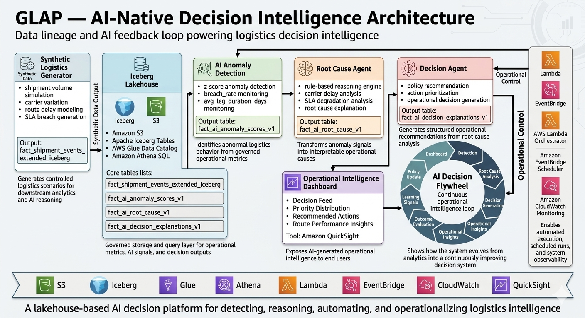
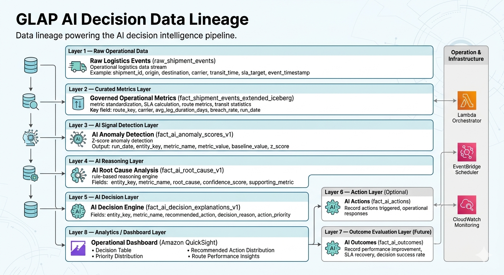

# GLAP — AI-Native Logistics Decision Intelligence Platform

GLAP (Global Logistics Analytics Platform) is an AI-native logistics decision intelligence system designed to transform traditional analytics pipelines into an automated operational AI platform.

The system detects logistics anomalies, performs root cause analysis, generates decision recommendations, and visualizes insights through operational dashboards.

This project demonstrates how logistics analytics systems can evolve into **AI-native decision intelligence platforms** built on modern lakehouse architecture and automated AI reasoning pipelines.

---

# System Architecture

GLAP integrates modern data engineering architecture with AI reasoning components:

Synthetic Data Generator  
→ Raw Logistics Data (Amazon S3)  
→ Iceberg Lakehouse (S3 + Glue + Athena)  
→ AI Anomaly Detection  
→ Root Cause Analysis  
→ Decision Engine  
→ Action Generation  
→ Operational Intelligence Dashboard (QuickSight)

This architecture enables a continuous **AI Decision Flywheel** for operational intelligence.

---

# Data Lineage

The AI decision pipeline follows a structured data lineage from raw logistics events to AI-generated operational actions.
raw_shipment_events
↓
fact_shipment_events_extended
↓
fact_ai_anomaly_scores
↓
fact_ai_root_cause
↓
fact_ai_decisions
↓
fact_ai_actions
↓
fact_ai_outcomes

This structured lineage ensures that AI insights remain traceable and explainable across the entire pipeline.

---

# Dashboard Demonstrations

The system generates operational insights through AI-driven dashboards.

### AI Detection Dashboard

Anomaly detection insights across logistics routes and carriers.

[View Dashboard](GLAP - AI Detection.pdf)

---

### AI Decision Dashboard

Operational decisions generated by the AI decision engine.

[View Dashboard](GLAP - AI Decision.pdf)

---

### AI Ops Decision Dashboard

Operational insights supporting logistics performance optimization.

[View Dashboard](GLAP - AI Ops Decision.pdf)

---

### AI Learning Dashboard

System learning insights based on historical decision outcomes.

[View Dashboard](GLAP - AI Learning.pdf)

---

### AI Learning Monitoring Dashboard

Operational monitoring dashboard tracking system learning signals and calibration.

[View Dashboard](GLAP - AI Learning Dashboard.pdf)

---

# Key Features

### AI Anomaly Detection
Automatically detect abnormal logistics behavior using statistical anomaly detection techniques.

### Root Cause Analysis
Identify operational causes behind anomalies across routes, carriers, and regions.

### Decision Recommendation Engine
Generate structured logistics actions and operational recommendations.

### Lakehouse Data Platform
Built on Apache Iceberg with AWS S3, Glue Data Catalog, and Athena.

### Automated AI Pipeline
Daily orchestration using AWS Lambda and EventBridge scheduling.

### Operational Intelligence Dashboards
Visualize AI insights through Amazon QuickSight dashboards.

---

# AI Decision Flywheel

GLAP forms a continuous operational intelligence loop:

Detection  
→ Root Cause Analysis  
→ Decision Generation  
→ Operational Insights  
→ Outcome Evaluation  
→ Learning Signals  
→ Policy Update  

This flywheel enables the platform to continuously improve operational decision quality.

---

# Technology Stack

- Amazon S3
- Apache Iceberg
- AWS Glue Data Catalog
- Amazon Athena
- AWS Lambda
- Amazon EventBridge
- Amazon CloudWatch
- Amazon QuickSight
- Python
- SQL

---

# Repository Structure

GLAP-AI-Decision-Platform/
│
├── README.md
├── GLAP_Technical_Implementation.md
│
├── docs/
│ ├── architecture.png
│ └── data_lineage.png
│
├── GLAP - AI Decision.pdf
├── GLAP - AI Detection.pdf
├── GLAP - AI Learning.pdf
├── GLAP - AI Learning Dashboard.pdf
└── GLAP - AI Ops Decision.pdf

---

# Technical Implementation

Detailed system implementation documentation:

[Technical Implementation Guide](GLAP_Technical_Implementation.md)

This document includes:

- synthetic logistics data generation
- Iceberg lakehouse architecture
- anomaly detection pipeline
- AI reasoning system
- decision engine
- Lambda orchestration
- EventBridge automation
- QuickSight dashboard integration

---

# Project Outcome

GLAP demonstrates how logistics analytics platforms can evolve into **AI-native decision intelligence systems** capable of automated anomaly detection, reasoning, recommendation, and operational visibility.

The project highlights the integration of modern data engineering practices with AI-driven operational intelligence.

---

# Author

Portfolio project demonstrating modern **AI-native data platform architecture and decision intelligence systems**.
