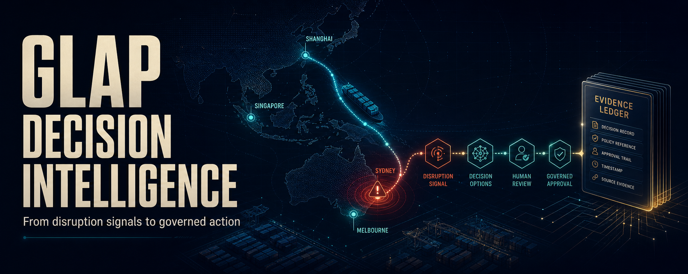
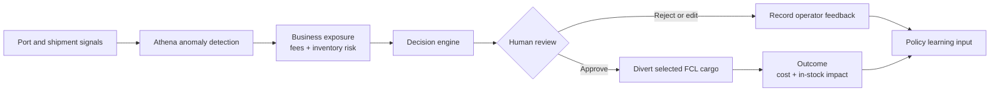
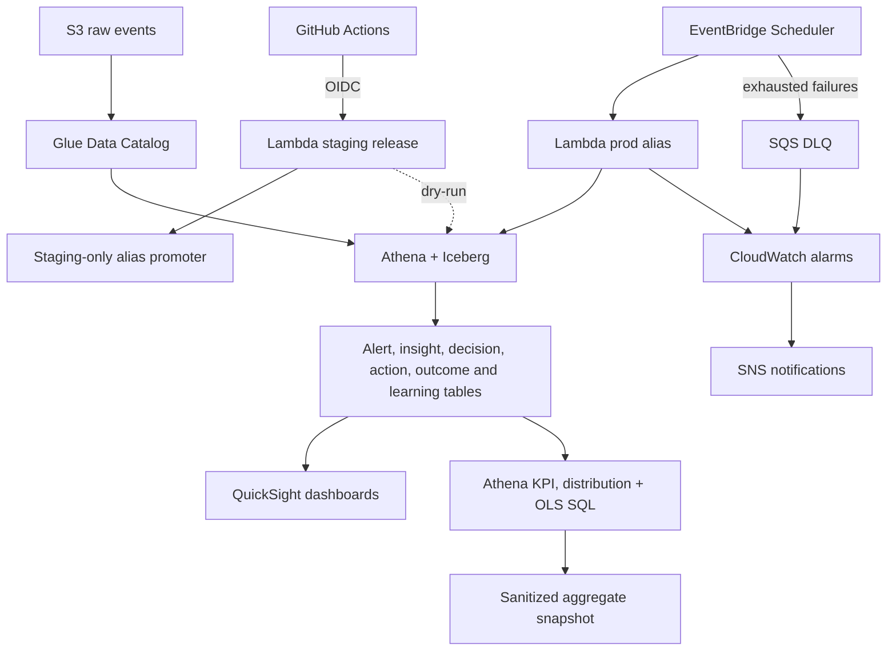

# GLAP: Logistics Decision Intelligence on AWS

[](https://github.com/Andy-JunXiong/GLAP-AI-Decision-Platform/actions/workflows/ci.yml)
[](https://andy-junxiong.github.io/GLAP-AI-Decision-Platform/)

**Turn logistics disruption signals into governed operational decisions.**

GLAP is an AWS decision-intelligence platform that detects abnormal shipment or
port conditions, explains the business exposure, recommends a bounded action,
and keeps human approval, execution evidence and outcomes traceable.



<p align="center">
  <strong>Follow one port-disruption decision from signal to evidence.</strong>
  <br><br>
  <a href="https://andy-junxiong.github.io/GLAP-AI-Decision-Platform/">Open the interactive product demo →</a>
  ·
  <a href="docs/demo_walkthrough.md">Follow the three-minute walkthrough</a>
  ·
  <a href="docs/aws_implementation_evidence.md">Inspect AWS evidence</a>
  ·
  <a href="docs/case_study_port_disruption.md">Read the decision case</a>
</p>

> **Project status:** AWS-deployed reference implementation, validated with
> synthetic logistics data. Runtime and deployment evidence is real; scenario
> costs and business outcomes are explicitly labelled synthetic.

> **5 August 2026 delivery checkpoint:** the stateful multimodal lifecycle and
> its read-only operations-analytics foundation are validated in isolated AWS
> staging. Maersk/KN Ocean and DHL Air share Origin/P2P/Destination semantics,
> while their milestones and cost units remain mode-specific. This staging path
> has no recurring schedule, production alias, or production-table write.

> **9 August 2026 status:** the authenticated private staging cockpit and
> governed human Action loop are implemented. One synthetic Action Outcome has
> matured on its actual Sydney calendar date; forecast history and supervised
> shipment labels remain insufficient, so model and production readiness are
> still blocked.

> **14 August 2026 evaluation checkpoint:** a local, read-only Evaluation
> Architecture now separates System Correctness, Capability Attribution,
> Decision Quality, and Business Outcome Effect. Its ten-event Historical
> Replay corpus covers AIR/OCEAN/RAIL/ROAD and HIGH/MEDIUM evidence with 30 frozen
> decision cutoffs. Structural coverage checks pass, but the corpus is not an
> eligible benchmark and contains no independent expert Decision Quality result.

> **17 August 2026 Human Evaluation status:** the corrected story-based
> A/B/Tie workflow is live as Sites v11 with five isolated reviewer accounts.
> Two eligible reviewers have each completed all 30 frozen packages and all
> required attestations. The declared minimum is three valid independent
> reviews, so Decision Quality remains `NOT_EVALUATED` and one more eligible
> submission is required before governed aggregation.

## Explore the interactive product story

The most complete product walkthrough is a self-contained browser demo:

1. [Open the live interactive demo](https://andy-junxiong.github.io/GLAP-AI-Decision-Platform/), or download the repository and open `offline/glap-demo.html` locally.
2. Follow the critical Sydney port decision from **Control Tower** to
   **Decision Brief**, change the diversion volume, approve or reject it, and
   inspect the resulting shipment, outcome and audit-ledger updates.

No installation, internet connection, AWS account or build step is required.
The demo runs entirely in the browser and does not send operational
instructions or persist synthetic records.

The published Control Tower reads a versioned, sanitized
[OPS snapshot contract](docs/ops_snapshot.md). It shows source provenance,
data date and freshness explicitly. Its KPIs and OLS forecast are calculated in
Athena at the governed logical run date, and its distributions reuse deployed
AWS result tables. GitHub Actions only publishes the aggregate contract. The
current Pages deployment is connected through the repository's read-only AWS
OIDC path; opening the HTML file directly still uses a clearly labelled
embedded fallback. The separate **Evaluation** page publishes only dated,
non-identifying progress totals and never reviewer answers or credentials.

[Read what is implemented and simulated](offline/README.md) ·
[Inspect the deployable web version](decision-brief-demo/README.md) ·
[View the QuickSight decision dashboard](docs/ai_decision_dashboard.png)

## 60-second case: avoid port storage fees and a stockout

A destination port is already congested when a labour-strike signal raises the
probability of a longer disruption. Twelve inbound FCL containers carry a
critical SKU, but available inventory covers only eight days.

| Decision input | Synthetic scenario value |
| --- | ---: |
| Port congestion index | `0.87` vs `0.35` baseline |
| Strike probability | `82%` |
| Expected port dwell | `9 days` |
| Free storage time | `3 days` |
| FCL containers exposed | `12` |
| Storage fee | `AUD 220 / container / day` |
| Inventory cover | `8 days` |
| Estimated no-action storage exposure | `AUD 15,840` |

**GLAP recommendation:** divert eight high-priority containers to Melbourne,
then move them to the Sydney distribution centre by rail or truck. Keep four
containers on the original route and review the disruption daily.

In the synthetic validation outcome, the reroute prevents an inventory stockout
and reduces the modelled storage exposure by `AUD 5,760` after reroute cost. This
is a demonstration of decision logic, not a measured production saving.

[Read the complete decision case](docs/case_study_port_disruption.md) ·
[Open the sample inputs and outputs](samples/port_disruption_signal.csv) ·
[Run the interactive demo](offline/glap-demo.html)

## From signal to action


```mermaid
flowchart LR
    A[Port and shipment signals] --> B[Athena anomaly detection]
    B --> C[Business exposure<br/>fees + inventory risk]
    C --> D[Decision engine]
    D --> E{Human review}
    E -->|Approve| F[Divert selected FCL cargo]
    E -->|Reject or edit| G[Record operator feedback]
    F --> H[Outcome<br/>cost + in-stock impact]
    G --> I[Policy learning input]
    H --> I
```

The system is designed to support an operator, not silently replace one. High-
priority recommendations remain reviewable and every decision can be traced to
its source metrics.

## Verified engineering evidence

| Capability | Verified status |
| --- | --- |
| AWS lakehouse | S3, Glue Catalog, Athena and Iceberg deployed |
| Decision orchestration | Python 3.14 Lambda deployed and smoke-tested |
| Scheduling and recovery | EventBridge Scheduler, two retries and encrypted SQS DLQ |
| Monitoring | CloudWatch alarms with SNS alarm and recovery notifications |
| Automated tests | Python 3.13 and 3.14 GitHub Actions CI |
| Versioned delivery | immutable Lambda versions with `staging` and `prod` |
| AWS authentication | GitHub OIDC; no long-lived deployment key |
| Staging safety | dry-run validation and staging-only alias promoter |
| Published OPS analytics | scheduled current-flywheel and existing-result aggregates with per-stage freshness |
| Forecast baseline | 28-day `dt` history with Athena-calculated seven-day OLS volume forecast |
| Stateful multimodal staging | Cross-date lifecycle for Maersk/KN Ocean and DHL Air; 15--20% simulated Air booking control |
| Multimodal analytics foundation | Six read-only Athena views plus 8 fail-closed operations/feature/label checks |
| Forecast validation | Private AWS backtest retained recent-level for Maersk; DHL/KN remain partial-history and supervised labels remain blocked |
| Authenticated Operations | Private staging cockpit with Cognito roles, governed Action mutations, Outcome Review, Pipeline Health, Forecast Accuracy and authorised Network drill-down |
| Drift prevention | Staged-snapshot pre-commit gate plus independent CI architecture/capability audit |
| Decision evaluation | Versioned local A303 ON/OFF ablation with read-only System Correctness and Capability Attribution checks |
| Historical Replay | Ten-event hybrid corpus with 30 frozen cutoffs, two complete eligible reviews, and an explicit `NOT_MET` gate until the three-review minimum and governed aggregation are complete |

One measured reliability improvement reduced a duplicate-only scheduled run from
approximately **55.37 seconds to 2.34 seconds**. The synthetic data generator is
configured for roughly **400–500 shipments per day**.

See [AWS implementation evidence](docs/aws_implementation_evidence.md) and
[infrastructure boundaries](INFRASTRUCTURE.md) for the exact claims and limits.

## Current AWS architecture


```mermaid
flowchart TB
    EB[EventBridge Scheduler] --> PROD[Lambda prod alias]
    GH[GitHub Actions] -->|OIDC| STAGE[Lambda staging release]
    STAGE --> PROMOTER[Staging-only alias promoter]

    S3RAW[S3 raw events] --> GLUE[Glue Data Catalog]
    GLUE --> ATHENA[Athena + Iceberg]
    PROD --> ATHENA
    STAGE -. dry-run .-> ATHENA
    ATHENA --> TABLES[Alert, insight, decision, action, outcome and learning tables]
    TABLES --> QS[QuickSight dashboards]
    TABLES --> ATHENAOPS[Athena KPI, distribution + OLS SQL]
    ATHENAOPS --> PAGES[Sanitized aggregate snapshot]

    EB -->|exhausted failures| DLQ[SQS DLQ]
    PROD --> CW[CloudWatch alarms]
    DLQ --> CW
    CW --> SNS[SNS notifications]
```

[View the architecture with trust boundaries](docs/architecture_current.md).

## Why this design

- **Lakehouse:** shipment schemas and decision artifacts evolve; Iceberg provides
  ACID tables and schema evolution on S3.
- **Deterministic decision logic:** operational recommendations remain
  explainable, testable and auditable.
- **Human review:** expensive actions such as port diversion require an operator
  decision and can capture edits or rejection reasons.
- **Versioned delivery:** `$LATEST` is only a candidate; `staging` is validated
  before an approved version can move to `prod`.
- **Extension path:** Bedrock can later assist with explanation and policy
  refinement without replacing deterministic safety rules.

## Explore the project

- [Port disruption case study](docs/case_study_port_disruption.md)
- [Current AWS architecture](docs/architecture_current.md)
- [Evaluation Architecture](docs/evaluation_architecture.md)
- [Decision Quality review contract](docs/decision_quality_evaluation.md)
- [Historical Replay Lab](docs/historical_replay_lab.md)
- [Versioned deployment workflow](docs/deployment_workflow.md)
- [Technical implementation](docs/GLAP_Technical_Implementation.md)
- [Decision flywheel evidence](docs/decision_flywheel_evidence.md)
- [Stateful shipment lifecycle design](docs/shipment_lifecycle_design.md)
- [Stateful lifecycle AWS staging deployment](docs/stateful_lifecycle_aws_deployment.md)
- [Public OPS snapshot contract](docs/ops_snapshot.md)
- [Athena OPS analytics and forecast SQL](sql/03_ops_analytics.sql)
- [Multimodal operations, feature and label views](sql/09_multimodal_ops_analytics.sql)
- [Multimodal forecast feature contract](docs/multimodal_forecast_feature_contract.md)
- [Long-term development direction and capability gates](DEVELOPMENT_PLAN.md)
- [Current development reality, Active Slice and Next Up](CURRENT_DEVELOPMENT_STATUS.md)
- [Completed capability and daily evidence archive](docs/archive/status/README.md)
- [Three-minute product demo script](docs/demo_walkthrough.md)
- [Zero-install interactive demo](offline/glap-demo.html)
- [QuickSight detection dashboard](docs/ai_detection_dashboard.png)
- [QuickSight decision dashboard](docs/ai_decision_dashboard.png)
- [QuickSight operations dashboard](docs/ai_ops_dashboard.png)
- [QuickSight learning dashboard](docs/ai_learning_dashboard.png)

## Repository map

```text
lambda/    deployed and deployment-support Lambda source
sql/       Athena/Iceberg DDL, orchestration and validation queries
tests/     unit tests for orchestration, dry-run and alias promotion
samples/   synthetic safe data and end-to-end decision examples
docs/      architecture, case studies, dashboards and evidence
examples/  simplified teaching examples
offline/   zero-install interactive product demo
decision-brief-demo/ deployable web product demo
blinded-review-survey/ authenticated blinded-review site and corrected Human Evaluation candidate
```

## Evidence boundaries

- All public shipment records, disruption scenarios and outcomes are synthetic.
- AWS runtime, version, CI/CD and reliability claims are based on inspected
  deployed resources and recorded runs.
- Estimated fees and avoided costs are scenario calculations, not production
  financial results.
- Current decision generation is deterministic and explainable; autonomous model
  learning and measured production impact are future capabilities.
- The current production-boundary generator remains separate from the isolated
  lifecycle staging path. Stateful cross-date shipment progression and
  multimodal analytics are proven in staging, but recurring execution and
  production-v2 promotion remain disabled; see the
  [stateful shipment lifecycle design](docs/shipment_lifecycle_design.md).

## Author

Portfolio project focused on AWS lakehouse architecture, serverless reliability,
and practical decision intelligence for logistics operations.
