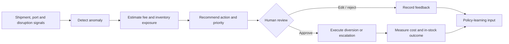
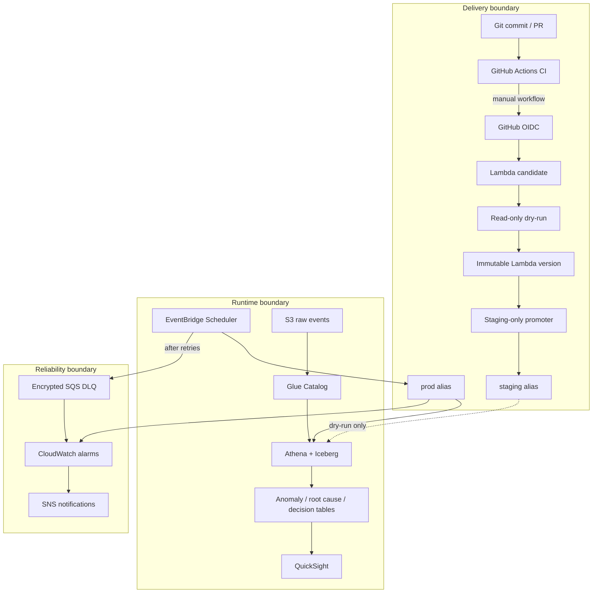

# Current Architecture and Trust Boundaries

## Product decision flow

## AWS runtime and delivery architecture

## Key controls

- GitHub receives short-lived AWS credentials through OIDC.
- The staging deployer cannot update the `prod` alias.
- Candidate and staging smoke tests use dry-run mode and do not insert decisions.
- Alias mutation is delegated to code hard-locked to `staging`.
- Production Scheduler targets `prod`, not mutable `$LATEST`.
- Failed scheduled invocations retry twice before entering the encrypted DLQ.
