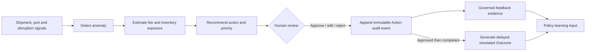
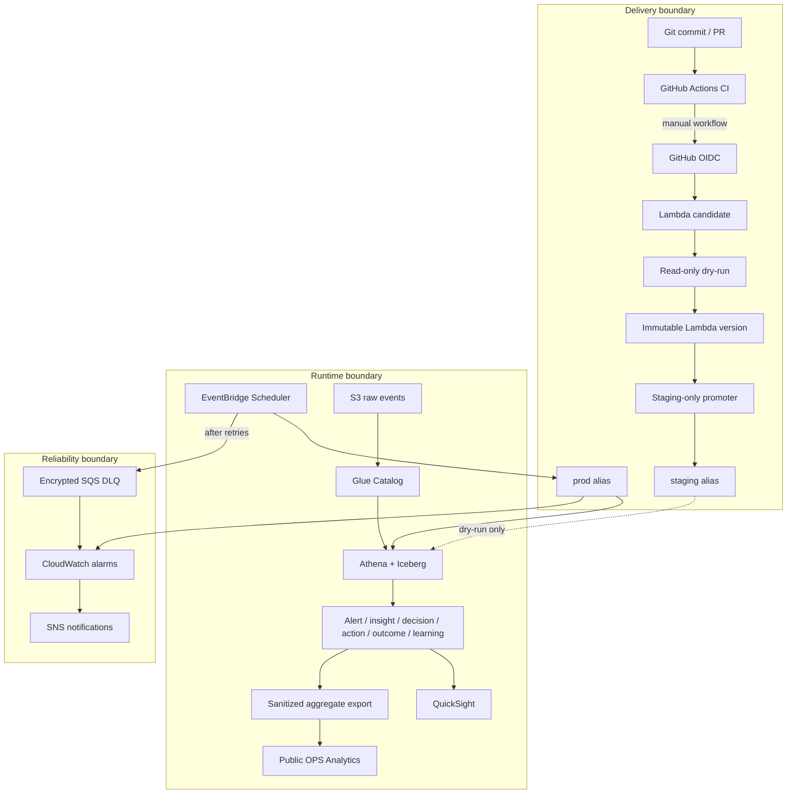
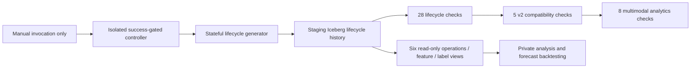
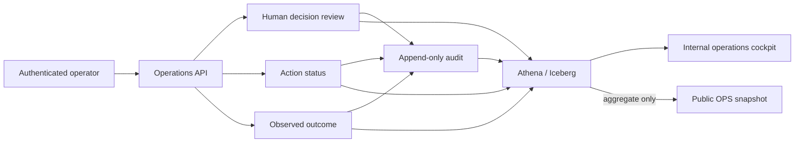

# Current Architecture and Trust Boundaries

## Product decision flow

```mermaid
flowchart LR
    SIGNALS[Shipment, port and disruption signals] --> DETECT[Detect anomaly]
    DETECT --> EXPOSE[Estimate fee and inventory exposure]
    EXPOSE --> DECIDE[Recommend action and priority]
    DECIDE --> REVIEW{Human review}
    REVIEW -->|Approve / edit / reject| ACTION[Append immutable Action audit event]
    ACTION -->|Approved then completed| OUTCOME[Generate delayed simulated Outcome]
    ACTION --> FEEDBACK[Governed feedback evidence]
    FEEDBACK --> LEARN[Policy-learning input]
    OUTCOME --> LEARN
```

The Action node records an immutable governed audit event; it does not command
an external carrier, port, or logistics system. Outcome generation is delayed,
reproducible, and `SIMULATED`, not a measurement of real business performance.

Public decision, execution, Outcome, and value statements now have a separate
Claim Truth boundary. The compact
`HIGH_RISK_DECISION_EXECUTION_OUTCOME_VALUE_CLAIMS_V1` manifest maps each
in-scope public semantic region to exactly one of `RUNTIME_BACKED`,
`MODELLED_SYNTHETIC`, or `ILLUSTRATIVE`, binds it to a source marker and
disclosure, and requires a repository backing source for modelled or runtime
claims. This is a display/evidence contract, not a new operational component;
it performs no network call, publication, deployment, or mutation.

Decision Truth has two deterministic `decision-brief.v1` contracts. The
authenticated Risk response derives the deployed SLA contract for valid
current open `SLA_BREACH` shipment-milestone Alerts and the deployed Cost extension
for valid `COST_ANOMALY` shipment-total-cost Alerts. SLA selects
`EXPEDITE_MILESTONE`; Cost selects `REVIEW_COST` from the exact governed
variance/threshold inputs and binds calculation source
`stateful-cost-variance.v1`. Because the persisted Alert does not carry a
rate-card version, the Cost contract exposes that value as unavailable and
never infers an identifier. Both include monitor/no-action alternatives and
keep expected benefit `NOT_ESTIMATED`; no monetary exposure, intervention
effect, execution, or Outcome is inferred. The private UI links onward to the
Action Board without mutation. Both contracts are deployed and reader/RBAC
verified. A natural SLA proposal now has aggregate runtime binding evidence;
the Cost cohort still has no natural runtime proposal.

The source tree also contains a fail-closed, aggregate-only SLA runtime
reconciler. It requires exactly one eligible same-date source Alert, one of the
seven governed milestone/metric pairs, the exact immutable
`decision-brief.v1` / `EXPEDITE_MILESTONE` binding and calculated rationale,
current-view agreement, and an intact pre-release SLA legacy-null boundary. Its
separately authorized `2026-08-27` staging run found natural proposals; source,
immutable-state, current-view, and legacy-null checks passed, but at least one
proposal failed the exact binding and the invalid-binding count was non-zero.
The gate failed closed without establishing a root cause or runtime binding
evidence. Any future Athena run requires separate human authorization because
the service persists a protected query-result object.

The separately authorized binding-diagnostic run retained the full seven-check
gate and added five identifier-free booleans. Brief version, Action type, and
selected alternative passed; rationale shape and rationale value failed.
Versioned deployed source matches the expected template, but aggregate evidence
cannot distinguish persisted-text from verifier-expression drift. It repaired
nothing and established no root cause.

The reconciler also has a regex-independent rationale diagnostic. It preserves
the full and binding gates and adds five identifier-free booleans for rationale
presence, exact milestone prefix, governed suffix, numeric token, and numeric
equality. Its first separately authorized execution failed before results on
`ENDS_WITH_EXPRESSION`; after a local `length` plus `substr` correction, the
separately authorized retry returned all five rationale-only booleans true
while the legacy regex checks remained false. This validates the persisted
rationale and isolates verifier drift: `[A-Z_]+` excludes digits in governed
`P2P_*` milestones. The local full-gate verifier now reuses the compositional
rationale checks and contains no rationale regex. The separately authorized
corrected full reconciliation returned all seven aggregate booleans true,
establishing synthetic staging runtime evidence for the natural SLA Decision
binding. It cannot repair a row and performed no mutation.

The source tree also contains a read-only aggregate SLA Outcome provenance
readiness audit. It joins only the exact bound operational actual-calendar SLA
cohort, named-human audit summaries, and latest cutoff-eligible Outcomes. Seven
bounded states distinguish expected workflow absence from contract drift; only
drift fails closed. The separately authorized `2026-08-27` audit returned
`WAITING_HUMAN_REVIEW`: the exact-bound proposal exists, but no named-human
completion or Outcome exists, and every drift check remained valid. It printed
no counts, actors, effects, or identifiers and advanced no workflow.

The source tree now contains a fail-closed, aggregate-only Cost runtime
reconciler. It is designed to inspect a naturally generated actual-calendar
proposal and validate the exact source Alert, immutable binding, current-view
projection, and legacy-null boundary without exposing identifiers or invoking
the Generator. The separately authorized `2026-08-27` staging query found zero
natural Cost proposals, so the gate failed closed and established no runtime
binding evidence. Any future Athena rerun requires separate human authorization
because the service persists a protected query-result object.

Decision-to-Action binding extends the deployed slice without introducing a
new write surface. The lifecycle generator stamps the brief version,
deterministic alternative, and rationale onto each newly eligible immutable
SLA Action proposal. The deployed Cost extension reuses the fields with
`REVIEW_COST` and a source-versioned rationale. The authenticated queue and
evidence chain read those fields beside append-only named-human review reasons.
Legacy and pre-release Cost Actions remain explicitly unbound. A named human
applied the additive isolated-staging
migration on `2026-08-25`; all six aggregate checks returned zero. The
independent producer is deployed and artifact/configuration verified. It was
later invoked by bounded actual-calendar run `33020683956`, but that workflow
did not expose aggregate proposal or binding counts. The SLA and Cost readers
are deployed and reader/RBAC verified; the revised exact-pair validator has not
run in staging, the corrected SLA reconciler passed all seven runtime checks,
and the Cost reconciler found no natural candidate.

The Decision Truth staging handoff makes the producer dependency explicit:
after the now-validated additive schema, the isolated lifecycle producer had
to be released before new proposals could carry truthful bindings. Plan run
`32920083879` from `fd6d532` proved that the former shared-stack release still
changed the controller role and function through dependency propagation, even
with the deployed template and previous parameters. It executed no change set.

The local architecture therefore gives `LifecycleGeneratorFunction` to
`glap-stateful-lifecycle-generator-staging`, a stack with exactly one resource.
The shared stack retains its execution role, alarm, controller, quality gate,
and Action mutation boundary, but uses the fixed function name/ARN rather than a
CloudFormation reference. Stack-refactor planning and execution are separate
manual actions; later Generator releases also have separate plan and deploy
actions and accept only one non-replacing Lambda modification. The shared
deployer packages no Generator and fails closed until exclusive destination
ownership is verified. Operations API and private frontend remain downstream
readers. The bounded IAM reconciliation is applied and directly verified.
Human plan run `32938938361` failed closed before an executable preview because
CloudFormation rejected parameters on the new destination stack; no resource
moved. This repository revision contains a locally verified parameter-free
template correction; source-control and CI maturity are recorded by Git
history. Commit `21d0e3a` passed CI run `32944908271`. Stack-refactor execution,
deployment, role checks, and later operational continuation remain separately
human-owned.

The corrected plan run `32945123509` subsequently created an available preview.
CloudFormation reports one destination-stack `CREATE` metadata action plus one
`LifecycleGeneratorFunction` `MOVE`; the workflow failed only because its guard
counted both as resource actions. Read-only ownership checks show the Generator
still in the source stack and zero destination resources. The repository guard
now requires exactly that metadata-plus-resource pair, rejects every extra
action, and exposes a non-executing `inspect-refactor` path for the existing
preview. A local read-only invocation against that retained preview passed the
corrected gate and executed nothing. Named-human run `32948002162` later moved
the Generator into the independent stack; read-only acceptance found exactly
one destination Lambda and zero source Generator resources. Plan run
`32951563950` validated the exact-one release without upload, and separately
authorized run `32956001803` deployed the Generator from commit `9eb031f`.
Artifact/template/Lambda digest checks passed, the execution role was preserved,
the shared stack had no deployment-window event, and no alias exists. The
Operations API and private frontend were later deployed and reader/RBAC
verified. Bounded actual-calendar run `33020683956` invoked the Generator while
advancing `2026-08-27` and passed four stages plus all 41 checks. Its workflow
summary did not expose proposal counts, so Cost proposal existence and binding
correctness required aggregate reconciliation. The subsequent query found zero
natural Cost proposals and failed closed, establishing no runtime binding.

## Cross-cutting evaluation boundary

The repository now includes a local, deterministic, read-only Evaluation
Harness. It wraps the decision flow for paired capability-ablation and Agent
Runtime parity experiments; it is not another operational pipeline stage and
has no AWS, network, Action-mutation, approval, Outcome-write, production, or
scheduling authority.

Capability-neutral External Evidence and Decision Memory contracts now isolate
those inputs without extending A303. A governed local Agent Runtime v1 envelope
then supplies both capabilities to one deterministic reference adapter and one
independently implemented registered local adapter under identical tools,
cutoff-eligible inputs, budgets, redaction, and no-mutation authority. A frozen
registry binds each adapter to a distinct implementation ID, group, module, and
source digest, rejects imports and path escape, and permits calls only to four
pure builtins used by the frozen implementations. Its `propose_action()` output
is evaluation-only and
`request_approval()` is simulated; neither creates an Action or grants human
authority. Registered-host parity proves distinct local implementation and
interface mechanics only, not host authentication, model identity, or host
quality. The full shared input envelope is now content-addressed: a
canonical SHA-256 bundle freezes cutoff-eligible synthetic evidence and memory,
tools, budgets, capabilities, authority, and redaction. Both registered traces
bind to the same digest, while post-cutoff inputs remain outside the bundle.
Each host trace is separately content-addressed and replay-verified against the
bundle's expected tool sequence, result IDs, proposal, simulated approval, and
empty mutation list. This proves local trace integrity, not host identity,
model provenance, or host quality.

A fixed four-file offline adapter package now lets a separately supplied Python
implementation be inspected and replayed against the same bundle and trace
contracts. Source digest and AST checks reject imports, attribute/private-name
access, unexpected calls, decorators, annotations, and builtin shadowing before
two deterministic executions in an isolated local subprocess. The submitted
trace must exactly match the reconstructed trace. Package conformance does not
register the adapter or prove host/model identity, Decision Quality, Outcome
effect, deployment, or production readiness, and grants no network, dependency-
install, approval, Action, AWS, or operational-write authority.

The first controlled synthetic experiment holds the scenario, point-in-time
evidence, policy version, authority profile, and seed fixed while toggling the
versioned `A303_HIGH_RISK_ROUTE` rule contract. Its paired replay evaluates
System Correctness and Capability Attribution; it does not verify the deployed
A303 runtime. A local Decision Quality rubric and blinded-review gate are
implemented. Sites v12 provides seven isolated pseudonymous reviewer
accounts and preserves three complete story-v2 submissions. Two complete
mainland submissions passed the study-owner-approved frozen-v3 compatibility
check on `2026-08-22`. A read-only in-memory reconciliation now covers all five
submissions and 150 locked records while retaining only identity-free aggregate
evidence. Fourteen packages favour `glap-a303-on`, fourteen controls are
unanimous ties, and Cyclone Gabrielle T1 and T2 are both 3:2 with 60% consensus,
below the frozen 66.67% gate. Separate named-human records retain no conclusion
for both packages without overriding their raw no-winner results. The public
view was separately refreshed and runtime-verified with the aggregate-only
five-review result. A later repository-local versioned snapshot revision
replaces embedded totals with `public-evaluation-snapshot.v1`; its bounded
source-control release completed as commit `489ef90`. CI run `32741075346` and
Pages run `32741075493` passed, and live read-only checks verified the v1 JSON,
aggregate counts, all-false authority fields, page loader, and fail-closed state.
Decision Quality does not select Business Outcome simulator eligibility. A
parallel pre-specified synthetic path evaluates all sixteen attributed changes
and all fourteen no-delta controls using frozen Simulator v1, sensitivity
ranges, and capability gates. Controls remain exact-zero across the full grid,
but the current result is `NOT_ROBUST` (2 A303-on, 7 A303-off, and 7 immaterial
at base; 39.81% non-negative across all combinations). This evaluates synthetic
assumption robustness only; it does not measure a factual Outcome, validate
real logistics performance, establish production readiness, or gain any
operational authority. The former human-selected 15-package 14/0/1 run is
preserved as exploratory and is ineligible for the capability gate.
Two post-hoc A303.v2 eligibility guardrails were screened next with an anti-
abstention gate. The central-safe candidate retains only two action
opportunities and reaches 86.42% non-negative within that action subset; the
stable-positive-only candidate retains none. Both are rejected as development
candidates, cannot claim confirmation on the reused corpus, and add no rule-
activation authority. The human project owner subsequently selected
stop/retire. A303.v1 is closed from further progression while every review and
evaluation artifact remains preserved. It was never deployed, so this
repository-local direction change requires no runtime rollback.
The future calibration interface is local and read-only. It accepts factual
records only for observed-baseline calibration and requires independently
validated `PROSPECTIVE_CONTROLLED` actual-calendar pairs for A303 treatment-
effect calibration. No eligible pairs currently exist, and A303.v1 calibration
is now `CLOSED_NOT_APPLICABLE`; the generic interface remains inactive reusable
infrastructure. Staging simulations and test fixtures are ineligible.
See
[`evaluation_architecture.md`](evaluation_architecture.md) for the contract and
evidence boundaries.

A separate mainland reviewer surface uses a human-created Lambda Function URL
and isolated DynamoDB table. It accepts only pre-provisioned pseudonymous
accounts and serves no story material before login. The human-deployed
collection `glap-ten-story-review.v1` reuses the ten frozen stories and 30
package identifiers, conditionally locks every moment, supports resume, and
creates one final immutable submission. Its public health contract was
read-only verified against the repository build and bundle digest. The surface
has no operational authority. Its separate collection is not automatically
eligible, but the `2026-08-22` governed compatibility/import check passed for
its two complete submissions without changing either source.
See [`three_case_review_entry.md`](three_case_review_entry.md).

Historical Replay v0.9 adds a local ten-scenario hybrid corpus covering the
Baltimore, Panama Canal, Red Sea, FAA NOTAM, U.S. rail-labor, Gotthard road-
tunnel, Ever Given grounding, Cyclone Gabrielle road-network, and Singapore
container-port congestion events plus the Rio Grande do Sul flood-damaged
highway network. A version-frozen manifest runs 30 historical cutoffs across
OCEAN, AIR, RAIL, and ROAD, preserves scenario-level
attribution, and validates HIGH and MEDIUM severity bands. Structural coverage
gates, including scenario count, now pass. Five compatible reviews per cutoff
meet the minimum-review count. Fourteen package results favour
`glap-a303-on`, fourteen controls remain unanimous ties, and Cyclone Gabrielle
T1 and T2 are the two non-control no-winner packages; neither may be filled or
presented as a win. Public facts remain paraphrased and digested; enterprise
state remains aggregate controlled synthetic. The corpus is evaluation-only
and cannot enter operational views, readiness evidence, or production
reporting.

A content-addressed review freeze now binds the exact corpus manifest, ten
scenario bodies, and Decision Quality rubric. A deterministic local builder
produces 30 reviewer-safe packages and a separately held study-owner key while
excluding post-decision reveals. Five complete eligible human reviews now exist
across the governed collection surfaces, and the identity-free aggregate
reports the complete mixed package-level Decision Quality result. A separate
local evaluator consumes the full attributed set and negative controls
independently of review preference to create explicitly
`SIMULATED_COUNTERFACTUAL` robustness evidence; it never writes the governed
staging Outcome store.

The calibration runner consumes that private simulated report only as a model
prediction. It cannot accept the generated staging Outcome as factual treatment
evidence, approve an Outcome, mutate an Action, activate a policy, promote a
model, or produce a production-readiness decision.

## AWS runtime and delivery architecture

```mermaid
flowchart TB
    subgraph Delivery[Delivery boundary]
        DEV[Git commit / PR] --> CI[GitHub Actions CI]
        CI -->|manual workflow| OIDC[GitHub OIDC]
        OIDC --> CANDIDATE[Lambda candidate]
        CANDIDATE --> DRYRUN[Read-only dry-run]
        DRYRUN --> VERSION[Immutable Lambda version]
        VERSION --> PROMOTER[Staging-only promoter]
        PROMOTER --> STAGING[staging alias]
        PROD[prod alias]
    end

    subgraph Runtime[Runtime boundary]
        SCHEDULER[EventBridge Scheduler] --> PROD
        RAW[S3 raw events] --> GLUE[Glue Catalog]
        GLUE --> ATHENA[Athena + Iceberg]
        PROD --> ATHENA
        STAGING -. dry-run only .-> ATHENA
        ATHENA --> OUTPUTS[Alert / insight / decision / action / outcome / learning]
        OUTPUTS --> QS[QuickSight]
        OUTPUTS --> EXPORT[Sanitized aggregate export]
        EXPORT --> PAGES[Public OPS Analytics]
    end

    subgraph Reliability[Reliability boundary]
        SCHEDULER -->|after retries| DLQ[Encrypted SQS DLQ]
        PROD --> CW[CloudWatch alarms]
        DLQ --> CW
        CW --> SNS[SNS notifications]
    end
```

## Key controls

- GitHub receives short-lived AWS credentials through OIDC.
- The staging deployer cannot update the `prod` alias.
- Candidate and staging smoke tests use dry-run mode and do not insert decisions.
- Alias mutation is delegated to code hard-locked to `staging`.
- Production Scheduler targets `prod`, not mutable `$LATEST`.
- Failed scheduled invocations retry twice before entering the encrypted DLQ.
- The public Pages role is read-only and publishes aggregate analytics without
  entity, route, carrier, account, ARN, or S3 identifiers.
- The local Pages source watches the versioned Evaluation snapshot, exporter,
  frozen source contract, rubric, and review bundle. It must validate the exact
  aggregate-only projection before preparing or uploading a Pages artifact;
  this local gate is not evidence that a workflow ran or publication occurred.
- A post-deployment Evaluation canary is connected after the existing
  Pages deploy step. It uses unauthenticated reads only, requires the live page
  and v1 JSON to match their governed local sources, and fails on count,
  authority, loader, or fail-closed drift. Commit `3d9dc34`, CI run
  `32780350123`, and Pages run `32780350187` passed; the canary verified the
  deployed artifact without adding operational or publication authority.
- A connected stateful baseline may publish only when its latest eligible
  source metric date equals its governed cutoff; the UI exposes both dates.
- Current public health follows the v3/v2 decision flywheel. Stale v1 anomaly,
  root-cause, and decision tables remain historical evidence only.

## Isolated stateful multimodal staging boundary

The lifecycle and analytics foundation is deployed beside, not inside, the
production runtime boundary:

```mermaid
flowchart LR
    MANUAL[Manual invocation only] --> CTRL[Isolated success-gated controller]
    CTRL --> GEN[Stateful lifecycle generator]
    GEN --> ICE[Staging Iceberg lifecycle history]
    ICE --> LIFE[28 lifecycle checks]
    LIFE --> COMPAT[5 v2 compatibility checks]
    COMPAT --> ANALYTICS[8 multimodal analytics checks]
    ICE --> VIEWS[Six read-only operations / feature / label views]
    VIEWS --> PRIVATE[Private analysis and forecast backtesting]
```

Maersk and KN use Ocean routes, port milestones, containers, and per-container
cost. DHL uses Air routes, airport milestones, chargeable kilograms, and per-kg
cost. Origin, P2P, Destination, final delivery, SLA, and outcome semantics are
common. Lane decisions normalize simulated weight only for an explicit
Air-vs-Ocean cost comparison; operational commercial units remain separate.

The staging stack has no Scheduler resource, production alias, or permission to
write the current v2 production tables. Its next consumer is private,
time-ordered forecast backtesting, not autonomous production decisions.

Provider coverage inside the lifecycle quality gate is date-effective: the
current booking cohort must contain every active provider whose route
configuration is effective on that logical date. This is an integrity check,
not a claim that the three-provider program has enough actual-calendar history
for comparison, label readiness, or model readiness. Those maturity gates
remain separate and fail closed.

## Authenticated internal Operations boundary — implemented in private staging

The authenticated Operations API, Cognito four-role boundary, and private
Operations cockpit are implemented, deployed, and verified in private staging.
They support the governed Decision Queue, Action Board, `APPROVE` / `REJECT` /
`COMPLETE` mutations, Risk Hotspots, Outcome Review, Pipeline Health, Forecast
Accuracy, and authorised Network Drill-down. Public GitHub Pages remains
aggregate-only and read-only, with no private API or Cognito configuration.

The repository revision merged through PR #76 adds a private read-only
Action–Outcome evidence chain to that same boundary. One Action detail request joins its immutable
proposal, chronological append-only audit events, and latest eligible simulated
Outcome under the Sydney actual-calendar cutoff. The cockpit renders this as a
review timeline without exposing request IDs, scenario IDs, infrastructure
identifiers, or future simulations. After separate named-human authorization,
workflow run `32621697316` deployed the private API and the matching private
cockpit was deployed manually. Both post-release verifiers passed, including
all four read roles and temporary-user cleanup. The extension adds no mutation
or approval authority.

The same merged revision continues the closed loop from Outcome to Learning.
An authenticated `GET /v1/learning` aggregate counts only cutoff-eligible
observed Outcomes and reads the existing policy-proposal table. Its private
Learning Review shows whether the minimum evidence gate remains blocked and,
when present, exposes a proposal only as review-required. There is no policy
activation endpoint and deterministic rules remain authoritative. The same
staging release passed both explicit Learning evidence gates and reported the
gate still blocked at `1/20`, with no proposal present. The earlier
merge-triggered run remained plan-only; the later separately authorized
workflow dispatch performed the deployment.

The repository now also implements a local-only Outcome Review provenance
projection. The existing `GET /v1/outcomes` read joins each cutoff-eligible
Outcome to its immutable Action by `action_id` and exposes the nullable
Decision Brief version and selected alternative. It does not add a table,
write route, inferred legacy binding, causal-effect claim, deployment, or
production authority. The prerequisite Action schema migration is applied and
six-check validated in isolated staging; the API/frontend projection and
runtime binding remain undeployed and unverified.

The next local projection adds `outcome-cohort-summary.v1` to that same
authenticated response. It performs a separate no-limit aggregate over only
observed, numeric, cutoff-eligible Outcomes with complete immutable Decision
bindings. The private cockpit displays sample/status counts and descriptive
effect ranges while explicitly denying causal, realised-value, real-performance,
model-readiness, and policy-authority claims. No route, role, table, write path,
CloudFormation change, deployment, or production authority was added.

A fail-closed `outcome-cohort-evidence-sufficiency.v1` layer now sits inside
that local response. It consumes the versioned, project-owner-approved
`outcome-cohort-threshold-contract.v1`: 20 observed Outcomes and two represented
result states per Decision cohort. Runtime constants are bound to the
machine-readable repository contract, and drift checks fail if they diverge.
The UI shows the approved descriptive gate and each cohort's eligibility. This
adds no environment configuration, CloudFormation change, deployment,
causal/value claim, Learning change, model/policy authority, or production path.

An `outcome-cohort-evidence-gap.v1` projection derives each cohort's remaining
sample and result-state shortfall from those same approved targets. It is
returned inside the existing authenticated response and rendered in the
private cockpit. The projection is calculation-only and grants no authority to
create Outcomes, advance operational dates, or target result-state diversity.

The companion `outcome-cohort-descriptive-comparison.v1` projection fails
closed until two or more cohorts pass the approved gate. It then returns only
eligible cohorts' status percentages and effect ranges in stable source order.
No ranking, preferred alternative, causal/statistical superiority, or Action
recommendation is produced.

Every cohort returned by that available comparison also includes
`outcome-cohort-comparison-provenance.v1`. The nested projection traces the
aggregate to its immutable Decision binding, Sydney cutoff, evidence class,
cohort schema, and threshold contract. It is aggregate-only, exposes no Action,
Outcome, or shipment identifiers, and performs no additional query.

An `outcome-cohort-comparison-fingerprint.v1` integrity object hashes the
displayed comparison metrics and that complete provenance using deterministic
canonical JSON and SHA-256. Percentage inputs are fixed two-decimal strings so
server and browser verification use identical bytes. The digest is unsigned and supports content-
consistency verification only; it proves neither source authenticity nor
business validity and introduces no key or secret boundary.

The private cockpit now applies
`outcome-cohort-comparison-verifier.v1` before rendering those covered fields.
Browser Web Crypto recomputes the digest from the already-loaded response;
pending, unsupported, malformed, contract-drifted, or mismatched results
withhold comparison metrics and provenance. This adds no API request, route,
telemetry, persistence, identifier exposure, or mutation authority.

The verifier returns a bounded local diagnostic reason under
`outcome-cohort-comparison-diagnostics.v1`. The cockpit renders only fixed safe
copy and the code while the covered content remains withheld. Raw exceptions,
canonical payloads, covered values, and computed digests are not placed in the
diagnostic result, and no telemetry or persistence boundary is introduced.

A bounded `outcome-cohort-comparison-retry.v1` control permits at most one
browser-local re-verification per cohort and loaded response, and only for
`CRYPTO_UNAVAILABLE` or `VERIFICATION_ERROR`. It reuses the same in-memory
cohort, returns the card to its hidden pending state, and applies the new result
only while the same comparison-view object remains current. Structural
mismatches cannot retry, and no request, storage, telemetry, or mutation is
added.

An `outcome-cohort-comparison-envelope-validator.v1` boundary now runs on the
loaded Outcome response before React or per-cohort verification can iterate the
comparison. It reconciles the schema, availability status, parent and eligible
counts, cohort-array shape, descriptive-only scope, and all-false governance.
A present malformed envelope fails the complete Outcome load closed; omission
remains a backwards-compatible partial state. The validator makes no new
request and grants no authenticity, business-validity, Action, Learning,
deployment, or production authority.

The staging runtime now also exposes an authenticated
`GET /v1/label-readiness` projection and Provider Label Readiness cockpit page.
They aggregate only the governed operational label view by mode/provider under
the server-derived Sydney cutoff. Pending labels are coverage-only; future
simulations and entity identifiers are excluded. Exact 200/20/20/10 threshold
gaps permit supervised evaluation only and cannot authorize training,
promotion, deployment, scheduling, or production. The route, least-privilege
resource inventory, deployment preflight, role verifier, frontend, and tests
are deployed and runtime-verified in private staging. All four read roles passed
the aggregate contract and the temporary verification users were removed. The
surface grants no training, promotion, schedule, production, or mutation
authority and no current provider readiness result is claimed from AWS.

The repository implements an append-only `EDIT` event for a named
Action owner and due date. It moves `PROPOSED` to `EDITED` and still requires a
separate approver. A named human applied the additive staging schema migration
on 2026-08-13, and all five read-only validation checks returned zero. The
Operations API and private frontend were then released through separately
approved staging-only paths. Assignment-specific runtime and four-role checks
passed, and all temporary test users were removed. The named-human canary
completed on 2026-08-23: the response serialization fix was released through
the narrow protected path, the original request ID replayed with HTTP 200 and
no duplicate audit row, and a different named approver moved the Action from
`EDITED` to `APPROVED`. Reconciliation retained one `EDIT`, one `APPROVE`, two
distinct named actors, and the original assignment. `COMPLETE` and Outcome
creation remained separate human-owned steps. They were later separately
authorized and executed on `2026-08-25`: a named human recorded `COMPLETE`, and
one bounded actual-calendar continuation created a single `PENDING` simulated
Outcome due on `2026-08-28`. Both states passed aggregate-only reconciliation.
Observation remains calendar-gated and separately unauthorized before that
date; no production, schedule, alias, policy, or model authority was created.

The mutation Lambda release boundary is deployed and verified. A read-only Plan
precedes two separately protected GitHub environments: Prepare uploads one
content-addressed artifact and creates an unexecuted change set; Execute
revalidates and executes only that exact change set after a new human approval.
Distinct OIDC identities orchestrate the phases, while a CloudFormation-only
service role owns the exact Lambda update and rollback reads. Neither GitHub
identity can call the Lambda update API directly. The guard rejects every
change set except one non-replacing `ActionMutationFunction` property
modification and preserves the prior artifact for rollback.

The Action mutation function still resides in the shared lifecycle stack, so
the two release paths must also preserve CloudFormation ownership explicitly.
AWS persists a supplied stack service role; run `32383741062` demonstrated that
the narrow Action mutation role cannot safely own a later full lifecycle
update. The deployed architecture now uses a separate CloudFormation-only
lifecycle maintenance role for full lifecycle changes while preserving the
narrow Action mutation release role. Lifecycle change sets retain the reviewed
mutation artifact and reject any change to the mutation function or role. PRs
#74 and #75 supplied and hardened that boundary. A named IAM administrator
configured the role and protected staging variable; separately approved run
`32390505373` continued rollback without skipped resources, and run
`32390847334` completed the isolated stack update. Read-only inspection found
the stack at `UPDATE_COMPLETE` and the controller active on Python 3.14.
Diagnostic run `32391364627` passed all 28 checks for `2026-08-09` without
mutation. Cross-gap correction plan `32670942817` and isolated-staging release
`32671064789` then passed. A separately authorized one-date recovery run
`32671484061` completed 28 lifecycle, 5 compatibility, and 8 analytics checks
and persisted terminal success. Separately authorized baseline run
`32672560594` then created or replaced one aggregate view for cutoff
`2026-08-09` and passed 10/10 fail-closed checks. It remains synthetic,
engineering-only evidence with `real_world_evidence=false`. No seed,
production alias, schedule, Pages publication, or Action mutation was included.

The separately authorized aggregate-only Pages run `32673379142`, followed by
scheduled run `32682049141`, published commit `fed2462` successfully. Read-only
inspection found the daily OPS track current at `2026-08-24`, but the stateful
baseline retained cutoff `2026-08-09` with eligible source metrics only through
`2026-08-06`. The contract correction rejects that cutoff/source gap on a
connected publication and renders the two dates separately.

Named-human-authorized staging runs subsequently extended actual-calendar
source state through `2026-08-24`. Runs `32674455765` and `32676988757` covered
10–21 August and 22–24 August respectively, with four stages and 41 checks per
date. Redundant run `32728891520` was rejected before processing because its
older start date could not overwrite the newer status. Baseline run
`32729202007` then replaced one aggregate view at the 24 August cutoff and
passed the deployed 10-check contract. The stricter equality gate is
repository-implemented and locally verified; none of these runs moved a
production alias, created a schedule, published Pages, or mutated an Action.

Plan run `33020601008` and separately authorized continuation run `33020683956`
later advanced isolated actual-calendar state through `2026-08-27`. No seed or
scenario was used; four stages and all 41 checks passed. The baseline remains at
the earlier `2026-08-24` cutoff. The subsequent aggregate Cost query found zero
natural proposals and correctly failed closed.

Commit `28e3edf` later delivered the public display and strict exporter gate.
CI run `32731582106` and separately authorized aggregate-only Pages run
`32731582185` succeeded. A live read confirmed cutoff and source coverage both
at `2026-08-24`, with synthetic, engineering-only provenance. Pages performed
no lifecycle write and did not redeploy the SQL validator, production alias,
schedule, or Action path.

On 2026-08-10, the release path demonstrated both recovery and success. A first
execution exposed missing exact rollback reads and reached
`UPDATE_ROLLBACK_FAILED`; a named human corrected only those resource-specific
permissions and continued rollback without skipping a resource. The stack
returned to `UPDATE_ROLLBACK_COMPLETE` with the prior artifact restored. A new
Prepare and separately approved Execute then finished at `UPDATE_COMPLETE`, and
the active Lambda digest matched the reviewed artifact. This is AWS staging
delivery evidence, not an operational Action canary or production authority.

This staging deployment does not authorise production expansion: production
aliases, recurring lifecycle or forecast schedules, automatic policy
activation, supervised-model promotion, and public entity-level writes remain
separate human-approved decisions.

```mermaid
flowchart LR
    USER[Authenticated operator] --> API[Operations API]
    API --> REVIEW[Human decision review]
    API --> ACTION[Action status]
    API --> OUTCOME[Observed outcome]
    REVIEW --> AUDIT[Append-only audit]
    ACTION --> AUDIT
    OUTCOME --> AUDIT
    REVIEW --> LAKE[Athena / Iceberg]
    ACTION --> LAKE
    OUTCOME --> LAKE
    AUDIT --> LAKE
    LAKE --> INTERNAL[Internal operations cockpit]
    LAKE -->|aggregate only| PUBLISH[Public OPS snapshot]
```

The private staging boundary retains success-gated orchestration and
data-quality controls. Future simulations remain isolated engineering evidence
and do not establish operational performance, outcome maturity, model
readiness, promotion, or production reporting. See the
[development plan](../DEVELOPMENT_PLAN.md) for remaining production
readiness dependencies. The local-only Operations production-readiness evidence
harness reconciles those dependencies without calling AWS: its `2026-08-25`
manifest records four staging-runtime-verified gates and six incomplete gates,
so it fails closed to `NOT_READY_INCOMPLETE_EVIDENCE` and grants no production
authority.
