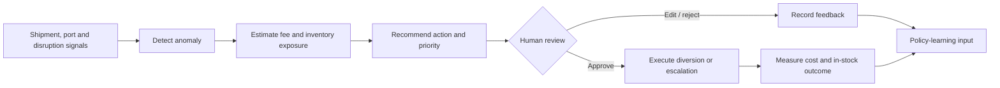
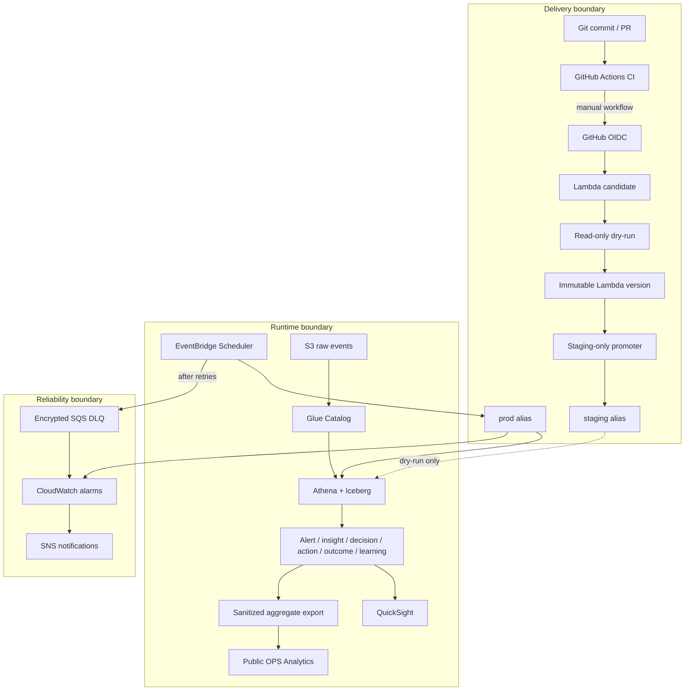
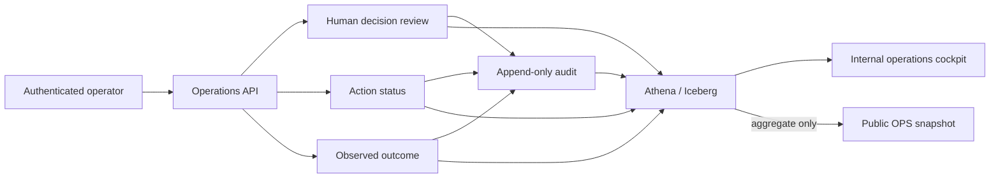

# Current Architecture and Trust Boundaries

## Product decision flow

```mermaid
flowchart LR
    SIGNALS[Shipment, port and disruption signals] --> DETECT[Detect anomaly]
    DETECT --> EXPOSE[Estimate fee and inventory exposure]
    EXPOSE --> DECIDE[Recommend action and priority]
    DECIDE --> REVIEW{Human review}
    REVIEW -->|Approve| ACTION[Execute diversion or escalation]
    REVIEW -->|Edit / reject| FEEDBACK[Record feedback]
    ACTION --> OUTCOME[Measure cost and in-stock outcome]
    FEEDBACK --> LEARN[Policy-learning input]
    OUTCOME --> LEARN
```

## AWS runtime and delivery architecture

```mermaid
flowchart TB
    subgraph Delivery[Delivery boundary]
        DEV[Git commit / PR] --> CI[GitHub Actions CI]
        CI -->|manual workflow| OIDC[GitHub OIDC]
        OIDC --> CANDIDATE[Lambda candidate]
        CANDIDATE --> DRYRUN[Read-only dry-run]
        DRYRUN --> VERSION[Immutable Lambda version]
        VERSION --> PROMOTER[Staging-only promoter]
        PROMOTER --> STAGING[staging alias]
        PROD[prod alias]
    end

    subgraph Runtime[Runtime boundary]
        SCHEDULER[EventBridge Scheduler] --> PROD
        RAW[S3 raw events] --> GLUE[Glue Catalog]
        GLUE --> ATHENA[Athena + Iceberg]
        PROD --> ATHENA
        STAGING -. dry-run only .-> ATHENA
        ATHENA --> OUTPUTS[Alert / insight / decision / action / outcome / learning]
        OUTPUTS --> QS[QuickSight]
        OUTPUTS --> EXPORT[Sanitized aggregate export]
        EXPORT --> PAGES[Public OPS Analytics]
    end

    subgraph Reliability[Reliability boundary]
        SCHEDULER -->|after retries| DLQ[Encrypted SQS DLQ]
        PROD --> CW[CloudWatch alarms]
        DLQ --> CW
        CW --> SNS[SNS notifications]
    end
```

## Key controls

- GitHub receives short-lived AWS credentials through OIDC.
- The staging deployer cannot update the `prod` alias.
- Candidate and staging smoke tests use dry-run mode and do not insert decisions.
- Alias mutation is delegated to code hard-locked to `staging`.
- Production Scheduler targets `prod`, not mutable `$LATEST`.
- Failed scheduled invocations retry twice before entering the encrypted DLQ.
- The public Pages role is read-only and publishes aggregate analytics without
  entity, route, carrier, account, ARN, or S3 identifiers.
- Current public health follows the v3/v2 decision flywheel. Stale v1 anomaly,
  root-cause, and decision tables remain historical evidence only.

## Planned internal operations boundary — not deployed

The next implementation phase adds authenticated writes without granting them
to GitHub Pages:

```mermaid
flowchart LR
    USER[Authenticated operator] --> API[Operations API]
    API --> REVIEW[Human decision review]
    API --> ACTION[Action status]
    API --> OUTCOME[Observed outcome]
    REVIEW --> AUDIT[Append-only audit]
    ACTION --> AUDIT
    OUTCOME --> AUDIT
    REVIEW --> LAKE[Athena / Iceberg]
    ACTION --> LAKE
    OUTCOME --> LAKE
    AUDIT --> LAKE
    LAKE --> INTERNAL[Internal operations cockpit]
    LAKE -->|aggregate only| PUBLISH[Public OPS snapshot]
```

Success-gated orchestration and data-quality controls are required before this
write boundary is enabled. See the
[implementation roadmap](implementation_roadmap.md) for dependencies and
acceptance criteria.
