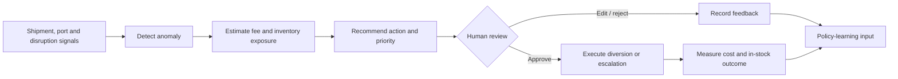
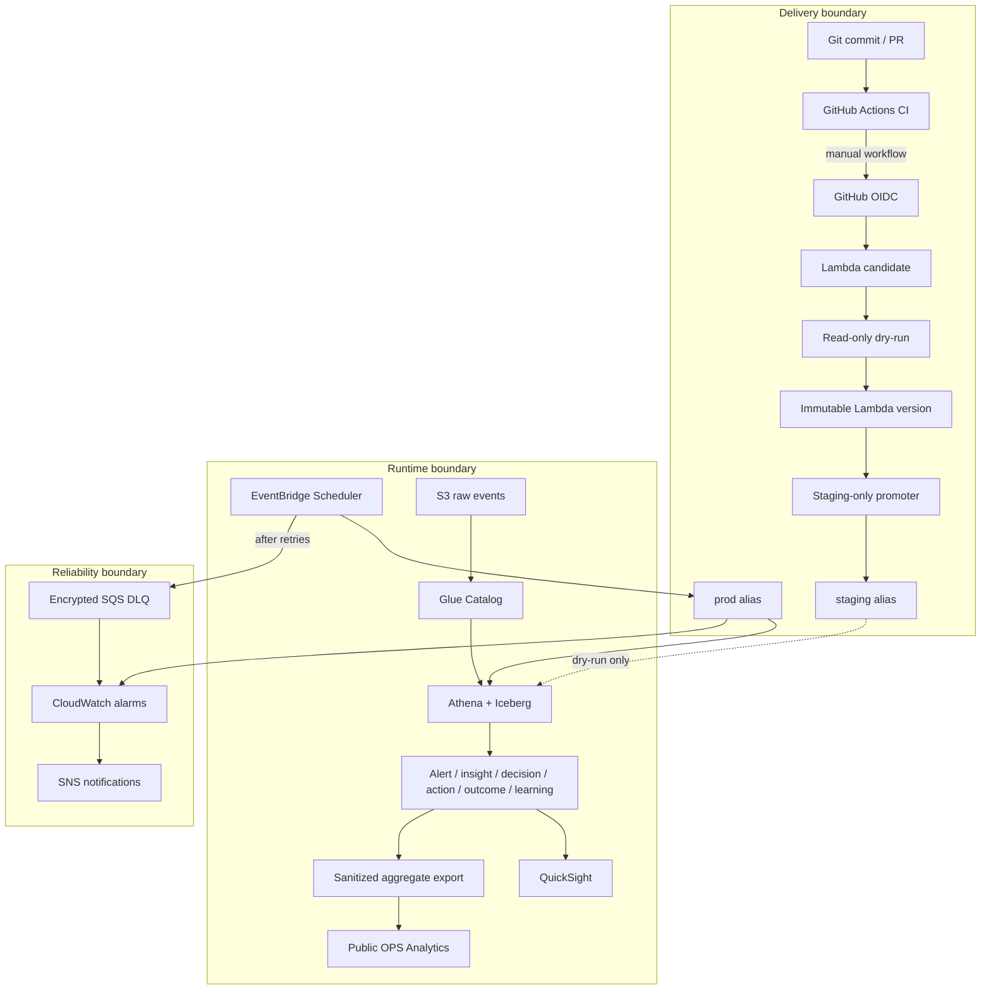
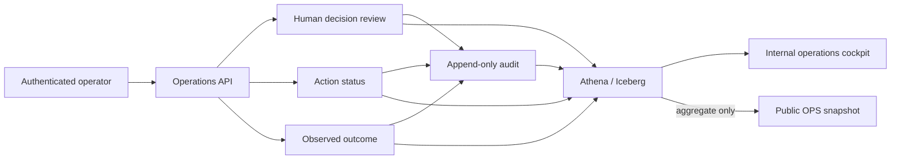

# Current Architecture and Trust Boundaries

## Product decision flow

```mermaid
flowchart LR
    SIGNALS[Shipment, port and disruption signals] --> DETECT[Detect anomaly]
    DETECT --> EXPOSE[Estimate fee and inventory exposure]
    EXPOSE --> DECIDE[Recommend action and priority]
    DECIDE --> REVIEW{Human review}
    REVIEW -->|Approve| ACTION[Execute diversion or escalation]
    REVIEW -->|Edit / reject| FEEDBACK[Record feedback]
    ACTION --> OUTCOME[Measure cost and in-stock outcome]
    FEEDBACK --> LEARN[Policy-learning input]
    OUTCOME --> LEARN
```

## Cross-cutting evaluation boundary

The repository now includes a local, deterministic, read-only Evaluation
Harness v0.1. It wraps the decision flow for paired capability-ablation
experiments; it is not another operational pipeline stage and has no AWS,
network, Action-mutation, approval, Outcome-write, production, or scheduling
authority.

The first controlled synthetic experiment holds the scenario, point-in-time
evidence, policy version, authority profile, and seed fixed while toggling the
versioned `A303_HIGH_RISK_ROUTE` rule contract. It evaluates System Correctness
and Capability Attribution only. It does not verify the deployed A303 runtime,
score Decision Quality, measure Business Outcome Effect, or establish
production readiness. A local Decision Quality rubric and blinded-review gate
are implemented, but no expert reviews exist and no quality result is claimed. See
[`evaluation_architecture.md`](evaluation_architecture.md) for the contract and
evidence boundaries.

Historical Replay v0.9 adds a local ten-scenario hybrid corpus covering the
Baltimore, Panama Canal, Red Sea, FAA NOTAM, U.S. rail-labor, Gotthard road-
tunnel, Ever Given grounding, Cyclone Gabrielle road-network, and Singapore
container-port congestion events plus the Rio Grande do Sul flood-damaged
highway network. A version-frozen manifest runs 30 historical cutoffs across
OCEAN, AIR, RAIL, and ROAD, preserves scenario-level
attribution, and validates HIGH and MEDIUM severity bands. Structural coverage
gates, including scenario count, now pass; benchmark eligibility remains blocked
by absent independent reviews. Public facts remain paraphrased
and digested; enterprise state remains aggregate controlled synthetic. The
corpus is evaluation-only and cannot enter operational views, readiness
evidence, or production reporting.

A content-addressed review freeze now binds the exact corpus manifest, ten
scenario bodies, and Decision Quality rubric. A deterministic local builder
produces 30 reviewer-safe packages and a separately held study-owner key while
excluding post-decision reveals. This is review-handoff infrastructure only:
no human reviews or Decision Quality result exist.

## AWS runtime and delivery architecture

```mermaid
flowchart TB
    subgraph Delivery[Delivery boundary]
        DEV[Git commit / PR] --> CI[GitHub Actions CI]
        CI -->|manual workflow| OIDC[GitHub OIDC]
        OIDC --> CANDIDATE[Lambda candidate]
        CANDIDATE --> DRYRUN[Read-only dry-run]
        DRYRUN --> VERSION[Immutable Lambda version]
        VERSION --> PROMOTER[Staging-only promoter]
        PROMOTER --> STAGING[staging alias]
        PROD[prod alias]
    end

    subgraph Runtime[Runtime boundary]
        SCHEDULER[EventBridge Scheduler] --> PROD
        RAW[S3 raw events] --> GLUE[Glue Catalog]
        GLUE --> ATHENA[Athena + Iceberg]
        PROD --> ATHENA
        STAGING -. dry-run only .-> ATHENA
        ATHENA --> OUTPUTS[Alert / insight / decision / action / outcome / learning]
        OUTPUTS --> QS[QuickSight]
        OUTPUTS --> EXPORT[Sanitized aggregate export]
        EXPORT --> PAGES[Public OPS Analytics]
    end

    subgraph Reliability[Reliability boundary]
        SCHEDULER -->|after retries| DLQ[Encrypted SQS DLQ]
        PROD --> CW[CloudWatch alarms]
        DLQ --> CW
        CW --> SNS[SNS notifications]
    end
```

## Key controls

- GitHub receives short-lived AWS credentials through OIDC.
- The staging deployer cannot update the `prod` alias.
- Candidate and staging smoke tests use dry-run mode and do not insert decisions.
- Alias mutation is delegated to code hard-locked to `staging`.
- Production Scheduler targets `prod`, not mutable `$LATEST`.
- Failed scheduled invocations retry twice before entering the encrypted DLQ.
- The public Pages role is read-only and publishes aggregate analytics without
  entity, route, carrier, account, ARN, or S3 identifiers.
- Current public health follows the v3/v2 decision flywheel. Stale v1 anomaly,
  root-cause, and decision tables remain historical evidence only.

## Isolated stateful multimodal staging boundary

The lifecycle and analytics foundation is deployed beside, not inside, the
production runtime boundary:

```mermaid
flowchart LR
    MANUAL[Manual invocation only] --> CTRL[Isolated success-gated controller]
    CTRL --> GEN[Stateful lifecycle generator]
    GEN --> ICE[Staging Iceberg lifecycle history]
    ICE --> LIFE[19 lifecycle checks]
    LIFE --> COMPAT[5 v2 compatibility checks]
    COMPAT --> ANALYTICS[8 multimodal analytics checks]
    ICE --> VIEWS[Six read-only operations / feature / label views]
    VIEWS --> PRIVATE[Private analysis and forecast backtesting]
```

Maersk and KN use Ocean routes, port milestones, containers, and per-container
cost. DHL uses Air routes, airport milestones, chargeable kilograms, and per-kg
cost. Origin, P2P, Destination, final delivery, SLA, and outcome semantics are
common. Lane decisions normalize simulated weight only for an explicit
Air-vs-Ocean cost comparison; operational commercial units remain separate.

The staging stack has no Scheduler resource, production alias, or permission to
write the current v2 production tables. Its next consumer is private,
time-ordered forecast backtesting, not autonomous production decisions.

## Authenticated internal Operations boundary — implemented in private staging

The authenticated Operations API, Cognito four-role boundary, and private
Operations cockpit are implemented, deployed, and verified in private staging.
They support the governed Decision Queue, Action Board, `APPROVE` / `REJECT` /
`COMPLETE` mutations, Risk Hotspots, Outcome Review, Pipeline Health, Forecast
Accuracy, and authorised Network Drill-down. Public GitHub Pages remains
aggregate-only and read-only, with no private API or Cognito configuration.

The repository implements an append-only `EDIT` event for a named
Action owner and due date. It moves `PROPOSED` to `EDITED` and still requires a
separate approver. A named human applied the additive staging schema migration
on 2026-08-13, and all five read-only validation checks returned zero. The
Operations API and private frontend were then released through separately
approved staging-only paths. Assignment-specific runtime and four-role checks
passed, and all temporary test users were removed. The named-human canary is
partially complete: one operator `EDIT` is persisted and resolves to `EDITED`;
a response serialization fix is pushed but not deployed, and stable retry plus
the separate approver decision remain pending.

The mutation Lambda release boundary is deployed and verified. A read-only Plan
precedes two separately protected GitHub environments: Prepare uploads one
content-addressed artifact and creates an unexecuted change set; Execute
revalidates and executes only that exact change set after a new human approval.
Distinct OIDC identities orchestrate the phases, while a CloudFormation-only
service role owns the exact Lambda update and rollback reads. Neither GitHub
identity can call the Lambda update API directly. The guard rejects every
change set except one non-replacing `ActionMutationFunction` property
modification and preserves the prior artifact for rollback.

On 2026-08-10, the release path demonstrated both recovery and success. A first
execution exposed missing exact rollback reads and reached
`UPDATE_ROLLBACK_FAILED`; a named human corrected only those resource-specific
permissions and continued rollback without skipping a resource. The stack
returned to `UPDATE_ROLLBACK_COMPLETE` with the prior artifact restored. A new
Prepare and separately approved Execute then finished at `UPDATE_COMPLETE`, and
the active Lambda digest matched the reviewed artifact. This is AWS staging
delivery evidence, not an operational Action canary or production authority.

This staging deployment does not authorise production expansion: production
aliases, recurring lifecycle or forecast schedules, automatic policy
activation, supervised-model promotion, and public entity-level writes remain
separate human-approved decisions.

```mermaid
flowchart LR
    USER[Authenticated operator] --> API[Operations API]
    API --> REVIEW[Human decision review]
    API --> ACTION[Action status]
    API --> OUTCOME[Observed outcome]
    REVIEW --> AUDIT[Append-only audit]
    ACTION --> AUDIT
    OUTCOME --> AUDIT
    REVIEW --> LAKE[Athena / Iceberg]
    ACTION --> LAKE
    OUTCOME --> LAKE
    AUDIT --> LAKE
    LAKE --> INTERNAL[Internal operations cockpit]
    LAKE -->|aggregate only| PUBLISH[Public OPS snapshot]
```

The private staging boundary retains success-gated orchestration and
data-quality controls. Future simulations remain isolated engineering evidence
and do not establish operational performance, outcome maturity, model
readiness, promotion, or production reporting. See the
[development plan](../DEVELOPMENT_PLAN.md) for remaining production
readiness dependencies.
