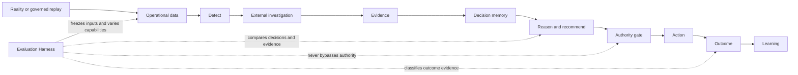

# GLAP Evaluation Architecture

**Contract version:** `evaluation-experiment.v1`
**Business timezone:** `Australia/Sydney`
**Current implementation:** local, deterministic, read-only A303 ablation,
four-review Decision Quality, pre-specified synthetic Outcome robustness, and
post-hoc A303.v2 candidate screening with an anti-abstention gate

## Purpose

GLAP must be able to show which capability changed a decision, whether the
changed decision was better, and whether it ultimately improved a business
outcome. The Evaluation Harness is therefore a cross-cutting evidence boundary,
not a stage in the operational decision flow and not an integration with one
agent framework.



The operational trust boundaries in
[`architecture_current.md`](architecture_current.md), the immutable Action and
Outcome rules in [`governed_closed_loop.md`](governed_closed_loop.md), and the
calendar rules in [`temporal_truthfulness.md`](temporal_truthfulness.md) remain
authoritative.

## Four evaluation layers

| Layer | Question | Initial evidence |
| --- | --- | --- |
| System Correctness | Did the system follow its contract? | Pass/fail contract checks, deterministic rerun, mutation isolation |
| Capability Attribution | Did the selected capability change the decision? | Paired ablation with all non-target inputs fixed |
| Decision Quality | Was one decision more reasonable using only then-available information? | Policy compliance, evidence coverage, risk detection, estimate error, latency, blinded expert agreement |
| Business Outcome Effect | Did the decision improve cost, delay, stock availability, or service? | Explicitly classified factual or counterfactual outcome evidence |

A decision difference is not a quality result. A quality result is not a
measured business effect. Reports must keep the four claims separate. The
preferred name for layer two is **Capability Attribution**, because “decision
effect” can be mistaken for a causal outcome claim.

## Experiment boundary

Every experiment is a paired comparison described by
[`evaluation_experiment_v1.schema.json`](evaluation_experiment_v1.schema.json).
The baseline and challenger receive the same scenario, cutoff, evidence
snapshot, operational state, authority profile, random seed, and policy/tool
versions. Only declared capability flags may differ.

The local harness must:

- make no AWS or network call;
- write no operational Decision, Action, audit, Outcome, or Learning row;
- never approve, reject, complete, or execute an Action;
- produce deterministic output for an identical manifest;
- retain the decision and rule trace for each variant;
- report unsupported evaluation layers as `NOT_EVALUATED`, never as zero or
  failure;
- make the exact changed capability explicit in the comparison result.

An evaluation report is repository engineering evidence. It is not an
operational decision, approval, shipment instruction, production result, or
authority grant.

## Point-in-time evidence

A scenario cutoff freezes what GLAP could have known, rather than merely when
an event occurred. Evidence records distinguish:

- `event_time`: when the represented event occurred;
- `published_at`: when the source published it;
- `available_at`: when GLAP could first have obtained it;
- `ingested_at`: when the evidence snapshot captured it;
- `revision_version`: which published revision is represented.

Only evidence with `available_at <= cutoff_at` is visible to a variant. Later
evidence may be retained in the scenario corpus to test the no-leakage gate,
but it cannot enter a decision. Historical source revisions must not be
silently replaced by their latest form.

The v0.1 A303 fixture is `CONTROLLED_SYNTHETIC_REPLAY` and
`SYNTHETIC_ENGINEERING_ONLY`. It validates evaluation mechanics only. It is not
a historical public-event corpus and does not establish real decision quality
or logistics performance.

## Evidence classes

Scenario inputs and outcome claims are classified independently.

Input scenarios:

- `CONTROLLED_SYNTHETIC_REPLAY`: all decision inputs are controlled fixtures;
- `HYBRID_HISTORICAL_REPLAY`: point-in-time historical external evidence plus
  controlled synthetic enterprise state;
- `OPERATIONAL_ACTUAL_CALENDAR`: governed operational inputs on or before the
  current Sydney date;
- `FUTURE_SIMULATION`: staging-only future scenario under the temporal
  truthfulness contract.

Outcome evidence:

- `NOT_EVALUATED`;
- `OBSERVED_FACTUAL`;
- `SIMULATED_COUNTERFACTUAL`;
- `MATCHED_OBSERVATIONAL`;
- `PROSPECTIVE_CONTROLLED`;
- `PRODUCTION_MEASURED`.

Advancing a historical replay reveals the factual historical outcome. It does
not reveal what would have happened under an unchosen GLAP action. Any such
estimate must identify its counterfactual method and cannot be relabelled as a
measured effect.

## Agent Runtime Interface

Agent hosts are replaceable adapters. A future host may use governed,
point-in-time tools such as:

```text
get_shipment(as_of)
get_evidence(as_of)
get_carrier_performance(as_of)
get_similar_decisions(as_of)
propose_action()
request_approval()
submit_outcome_evidence()
```

The interface fixes the evidence, tools, authority, redaction, and budget so
agent comparisons remain paired. `request_approval()` is simulated inside an
evaluation sandbox. An agent may submit outcome evidence, but it may not define
or validate the result of its own recommendation; an independent evaluator or
authorised human owns Outcome acceptance.

## v0.1 A303 experiment

The first fixture compares:

```text
baseline-a303-off: A303_HIGH_RISK_ROUTE = false -> MONITOR
glap-a303-on:      A303_HIGH_RISK_ROUTE = true  -> RISK_MITIGATION
```

The repository does not contain the deployed A303 implementation. The v0.1
runner therefore evaluates the versioned `A303.v1` rule contract represented
by the fixture; it does not claim runtime verification of the inspected AWS
rule path. Current governed staging code for `SLA_BREACH` and `COST_ANOMALY`
remains unchanged.

The paired ablation experiment evaluates System Correctness and Capability
Attribution. The Decision Quality rubric, v3 option-content contract, blinded package,
independent-review contract, and aggregation gate are implemented. The
formal Sites export also has an exact machine-readable v1 contract; its
finality is derived from a submitted timestamp, attestations, and 30 locked
answers, and any field change must use a new version. The
ten-event corpus, rubric, and option contract are content-addressed, and
deterministic blinded packages cover all 30 cutoffs. V1 and v2 collection is
paused and preserved draft progress is ineligible. The corrected story-based,
progressive A/B/Tie workflow is publicly released as Sites v12. It applies the
full 30-package v3 bundle with attestations, server save/resume, per-story
ordering, immutable submission, and isolated reviewer scopes. Seven hosted
Sites accounts exist, and two eligible story-v2 submissions are complete.
Two additional complete submissions from the content-equivalent mainland
entry passed the study-owner-approved compatibility/import check on
`2026-08-22`. The four-review private aggregate contains 120 locked records:
15 package results favour `glap-a303-on`, fourteen identical controls are
unanimous ties, and one non-identical package remains split 2:2. Decision
Quality is therefore evaluated with mixed package-level results. Decision
Quality remains parallel to, rather than an admission gate for, Business
Outcome simulation. The corrected robustness path evaluates all 16 attributed
decision changes and all 14 no-delta controls using the pre-frozen Simulator
v1, 243-combination sensitivity protocol, and synthetic capability gate. All
3,402 control comparisons are exact-zero, while the attributed result is
`NOT_ROBUST`: base-case counts are 2 A303-on, 7 A303-off, and 7 immaterial;
the full grid is 39.81% non-negative with 0 stable-positive, 2 parameter-
sensitive, and 14 stable-negative packages. This is an engineering result
about synthetic assumption robustness, not an observed factual outcome or
measured business effect. After
explicit publication approval, the live aggregate-only
Evaluation & Trust view shows these counts without private review content. See
[`decision_quality_evaluation.md`](decision_quality_evaluation.md).

Two bounded A303.v2 eligibility guardrails were then screened on the same
frozen space as explicitly `POST_HOC_DEVELOPMENT_EVIDENCE`. The anti-abstention
gate prevents a candidate from appearing robust merely by changing nearly all
actions to `MONITOR`. `a303-v2-central-safe` retains two action opportunities
and reaches 86.42% non-negative on that action subset; `a303-v2-stable-positive-
only` retains no actions. Neither passes the development gate, neither is
eligible for confirmation on the reused corpus, and no A303.v2 rule was created
or activated. The human project owner selected stop/retire on `2026-08-22`.
A303.v1 is closed from further threshold tuning, holdouts, prospective Outcome
collection, calibration, activation, and production progression; all evidence
remains preserved.

The versioned future A303 calibration interface is also implemented. It can
compare frozen simulated metrics with independently validated `OBSERVED_FACTUAL`
baseline records and `PROSPECTIVE_CONTROLLED` treatment pairs. Factual history
cannot be used to invent the outcome of an unchosen A303 action. Treatment-
effect calibration therefore requires at least three frozen actual-calendar
controlled pairs. No eligible pairs currently exist, and the preceding
synthetic gate is `NOT_ROBUST`; prospective calibration is therefore not the
active next slice.

Run it locally with:

```bash
python ops/evaluate_decision_capabilities.py \
  tests/fixtures/evaluation/a303_high_risk_route_v1.json
```

## Next increments

1. Keep A303.v1 retired and preserve its evidence. Continue evaluation-platform
   development with a capability-neutral External Evidence or Decision Memory
   ablation; any fundamentally new rule remains a separate human decision and
   would need a new frozen holdout.
2. If the study owner requires a resolved Decision Quality result for the one
   2:2 package, add
   a separate adjudication record without changing original reviews; otherwise
   retain the package as inconclusive.
3. Add External Evidence and Decision Memory ablations.
4. Add a governed Agent Runtime adapter and compare hosts using identical
   tools, evidence, budgets, and authority.
5. Only after a future rule passes its synthetic gate, compare eligible
   independently governed Outcome evidence with its frozen simulator using the
   calibration policy.
6. Use prospective controlled or measured production evidence only after
   separate human approval and production-readiness gates.
