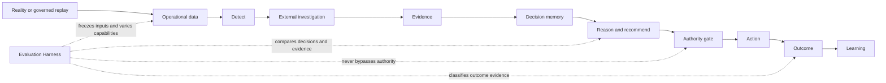

# GLAP Evaluation Architecture

**Contract versions:** `evaluation-experiment.v1` (frozen A303 evidence),
`evaluation-experiment.v2` (capability-neutral External Evidence ablation), and
`evaluation-experiment.v3` (capability-neutral Decision Memory ablation)
**Business timezone:** `Australia/Sydney`
**Current implementation:** local, deterministic, read-only A303, External
Evidence, and Decision Memory ablations; identity-free five-review Decision
Quality over 150 records; content-addressed no-winner governance records;
pre-specified synthetic Outcome robustness; and post-hoc A303.v2 candidate
screening with an anti-abstention gate

## Purpose

GLAP must be able to show which capability changed a decision, whether the
changed decision was better, and whether it ultimately improved a business
outcome. The Evaluation Harness is therefore a cross-cutting evidence boundary,
not a stage in the operational decision flow and not an integration with one
agent framework.



The operational trust boundaries in
[`architecture_current.md`](architecture_current.md), the immutable Action and
Outcome rules in [`governed_closed_loop.md`](governed_closed_loop.md), and the
calendar rules in [`temporal_truthfulness.md`](temporal_truthfulness.md) remain
authoritative.

## Four evaluation layers

| Layer | Question | Initial evidence |
| --- | --- | --- |
| System Correctness | Did the system follow its contract? | Pass/fail contract checks, deterministic rerun, mutation isolation |
| Capability Attribution | Did the selected capability change the decision? | Paired ablation with all non-target inputs fixed |
| Decision Quality | Was one decision more reasonable using only then-available information? | Policy compliance, evidence coverage, risk detection, estimate error, latency, blinded expert agreement |
| Business Outcome Effect | Did the decision improve cost, delay, stock availability, or service? | Explicitly classified factual or counterfactual outcome evidence |

A decision difference is not a quality result. A quality result is not a
measured business effect. Reports must keep the four claims separate. The
preferred name for layer two is **Capability Attribution**, because “decision
effect” can be mistaken for a causal outcome claim.

## Experiment boundary

Every experiment is a paired comparison. The frozen A303 experiment is
described by
[`evaluation_experiment_v1.schema.json`](evaluation_experiment_v1.schema.json),
while capability-neutral External Evidence experiments use
[`evaluation_experiment_v2.schema.json`](evaluation_experiment_v2.schema.json)
and Decision Memory experiments use
[`evaluation_experiment_v3.schema.json`](evaluation_experiment_v3.schema.json).
The baseline and challenger receive the same scenario, cutoff, evidence
snapshot, operational state, authority profile, random seed, and policy/tool
versions. Only declared capability flags may differ.

The local harness must:

- make no AWS or network call;
- write no operational Decision, Action, audit, Outcome, or Learning row;
- never approve, reject, complete, or execute an Action;
- produce deterministic output for an identical manifest;
- retain the decision and rule trace for each variant;
- report unsupported evaluation layers as `NOT_EVALUATED`, never as zero or
  failure;
- make the exact changed capability explicit in the comparison result.

An evaluation report is repository engineering evidence. It is not an
operational decision, approval, shipment instruction, production result, or
authority grant.

## Point-in-time evidence

A scenario cutoff freezes what GLAP could have known, rather than merely when
an event occurred. Evidence records distinguish:

- `event_time`: when the represented event occurred;
- `published_at`: when the source published it;
- `available_at`: when GLAP could first have obtained it;
- `ingested_at`: when the evidence snapshot captured it;
- `revision_version`: which published revision is represented.

Only evidence with `available_at <= cutoff_at` is visible to a variant. Later
evidence may be retained in the scenario corpus to test the no-leakage gate,
but it cannot enter a decision. Historical source revisions must not be
silently replaced by their latest form.

The v0.1 A303 fixture is `CONTROLLED_SYNTHETIC_REPLAY` and
`SYNTHETIC_ENGINEERING_ONLY`. It validates evaluation mechanics only. It is not
a historical public-event corpus and does not establish real decision quality
or logistics performance.

## Evidence classes

Scenario inputs and outcome claims are classified independently.

Input scenarios:

- `CONTROLLED_SYNTHETIC_REPLAY`: all decision inputs are controlled fixtures;
- `HYBRID_HISTORICAL_REPLAY`: point-in-time historical external evidence plus
  controlled synthetic enterprise state;
- `OPERATIONAL_ACTUAL_CALENDAR`: governed operational inputs on or before the
  current Sydney date;
- `FUTURE_SIMULATION`: staging-only future scenario under the temporal
  truthfulness contract.

Outcome evidence:

- `NOT_EVALUATED`;
- `OBSERVED_FACTUAL`;
- `SIMULATED_COUNTERFACTUAL`;
- `MATCHED_OBSERVATIONAL`;
- `PROSPECTIVE_CONTROLLED`;
- `PRODUCTION_MEASURED`.

Advancing a historical replay reveals the factual historical outcome. It does
not reveal what would have happened under an unchosen GLAP action. Any such
estimate must identify its counterfactual method and cannot be relabelled as a
measured effect.

## Agent Runtime Interface

Agent hosts now have a local v1 replaceable-adapter contract. The implemented
subset exposes these governed point-in-time tools:

```text
get_evidence(as_of)
get_similar_decisions(as_of)
propose_action()
request_approval()
```

[`agent_runtime_experiment_v1.schema.json`](agent_runtime_experiment_v1.schema.json)
fixes the evidence, memory, tools, authority, redaction, and budget so local
host comparisons remain paired. One reference adapter and one separately
registered local implementation receive identical cutoff-eligible inputs and
execute the same four-call sequence from distinct source paths.
`propose_action()` creates only an `EVALUATION_PROPOSAL_ONLY` object, while
`request_approval()` always returns `SIMULATED_PENDING_HUMAN_REVIEW` with no
authority and no operational Action. The interface has no network or AWS path.

The versioned
[`agent_runtime_host_registry_v1.json`](agent_runtime_host_registry_v1.json)
and its [Schema](agent_runtime_host_registry_v1.schema.json) bind exactly two
adapter versions to distinct implementation IDs, implementation groups,
repository-local modules, and normalized source digests. Validation rejects
path escape, digest drift, imports, and any call outside the four pure builtins
used by the frozen implementations. The registry also denies network authority,
operational writes, and dynamic dependency installation.
This proves inspectable local implementation separation; it does not
authenticate an external host or identify a model.

The v1 parity report evaluates System Correctness only. Equivalent registered
outputs prove adapter-envelope mechanics across distinct local implementations,
not host quality or model parity.
Capability Attribution, Decision Quality, and Business Outcome Effect remain
`NOT_EVALUATED`. `get_shipment`, `get_carrier_performance`, and
`submit_outcome_evidence` remain future interface candidates and are not
allowed by v1.

The adapter now builds a content-addressed input freeze under
[`agent_runtime_input_bundle_v1.schema.json`](agent_runtime_input_bundle_v1.schema.json).
Its canonical payload contains the complete cutoff-eligible synthetic evidence
and Decision Memory records plus the exact tools, budgets, capabilities,
authority, and redaction envelope. Records are sorted by stable ID before
SHA-256 calculation, so source-array order does not create false drift. The
source-manifest digest remains separate from the host-shared bundle digest.
Both hosts bind their trace to that same bundle digest, and an independent
verifier rejects structural, authority, post-cutoff, ordering, or payload-
digest drift.

Build the standalone freeze with:

```bash
python ops/build_agent_runtime_input_bundle.py \
  tests/fixtures/evaluation/agent_runtime_parity_v1.json
```

Each host execution now also emits a content-addressed submission governed by
[`agent_runtime_host_trace_v1.schema.json`](agent_runtime_host_trace_v1.schema.json).
The trace binds the host identity, enabled capabilities, ordered tool calls,
result IDs, proposal, simulated approval result, and empty mutation list to the
input-bundle digest. The offline replay verifier reconstructs the expected
visible IDs and proposal from the bundle, then rejects order, mode, budget,
result-set, approval, mutation, or digest drift.

This is an integrity and replay contract, not host authentication. A safe new
adapter identity may submit a structurally valid trace, but v1 does not prove
who operated it, whether it used a particular model, or whether its output is
better. Verify a saved submission with:

```bash
python ops/verify_agent_runtime_host_trace.py \
  artifacts/agent-runtime-input-bundle-v1.json \
  artifacts/agent-runtime-host-trace-v1.json
```

Separately supplied implementations now have a fixed offline conformance
package governed by
[`agent_runtime_adapter_package_v1.schema.json`](agent_runtime_adapter_package_v1.schema.json).
The package contains exactly four governed artifacts: `package.json`, one
import-free `adapter.py`, the complete content-addressed `input_bundle.json`,
and the submitted bundle-bound `host_trace.json`. Python bytecode cache created
by local validation is ignored and is never a package artifact.

The verifier checks the adapter source digest and a strict AST policy before
execution. The source may define only `run_adapter(request)`, cannot import,
use decorators or annotations, access attributes/private names, shadow the
four allowed pure builtins, or call anything outside that allowlist. It then
runs the adapter twice in an isolated `-I -S -B` Python subprocess with a
three-second limit, reconstructs the trace from the frozen bundle, and requires
the submitted and replayed traces to be byte-for-byte equivalent as canonical
JSON structures. Extra package files, path escape, symlinks, authority drift,
input tampering, nondeterminism, trace tampering, proposal drift, approval, or
operational mutation fail closed.

Passing this package proves only offline source inspection, deterministic
frozen-bundle replay, and submitted-trace integrity. It does not amend the host
registry, authenticate an operator or host, identify a model, compare quality,
establish an Outcome, or grant network, dependency-install, AWS, approval,
Action, deployment, or production authority. Verify a package with:

```bash
python ops/verify_agent_runtime_adapter_package.py \
  tests/fixtures/evaluation/adapter_conformance_v1
```

Run the local parity fixture with:

```bash
python ops/run_governed_agent_runtime.py \
  tests/fixtures/evaluation/agent_runtime_parity_v1.json
```

## v0.1 A303 experiment

The first fixture compares:

```text
baseline-a303-off: A303_HIGH_RISK_ROUTE = false -> MONITOR
glap-a303-on:      A303_HIGH_RISK_ROUTE = true  -> RISK_MITIGATION
```

The repository does not contain the deployed A303 implementation. The v0.1
runner therefore evaluates the versioned `A303.v1` rule contract represented
by the fixture; it does not claim runtime verification of the inspected AWS
rule path. Current governed staging code for `SLA_BREACH` and `COST_ANOMALY`
remains unchanged.

The paired ablation experiment evaluates System Correctness and Capability
Attribution. The Decision Quality rubric, v3 option-content contract, blinded package,
independent-review contract, and aggregation gate are implemented. The
formal Sites export also has an exact machine-readable v1 contract; its
finality is derived from a submitted timestamp, attestations, and 30 locked
answers, and any field change must use a new version. The
ten-event corpus, rubric, and option contract are content-addressed, and
deterministic blinded packages cover all 30 cutoffs. V1 and v2 collection is
paused and preserved draft progress is ineligible. The corrected story-based,
progressive A/B/Tie workflow is publicly released as Sites v12. It applies the
full 30-package v3 bundle with attestations, server save/resume, per-story
ordering, immutable submission, and isolated reviewer scopes. Seven hosted
Sites accounts exist, and three eligible story-v2 submissions are complete.
Two additional complete submissions from the content-equivalent mainland
entry passed the study-owner-approved compatibility/import check on
`2026-08-22`. A later read-only in-memory reconciliation covers all five
reviews and 150 locked records: 14 package results favour `glap-a303-on`,
fourteen identical controls are unanimous ties, and two non-identical packages
remain 3:2 below the consensus gate. Decision
Quality is therefore evaluated with mixed package-level results. Decision
Quality remains parallel to, rather than an admission gate for, Business
Outcome simulation. The corrected robustness path evaluates all 16 attributed
decision changes and all 14 no-delta controls using the pre-frozen Simulator
v1, 243-combination sensitivity protocol, and synthetic capability gate. All
3,402 control comparisons are exact-zero, while the attributed result is
`NOT_ROBUST`: base-case counts are 2 A303-on, 7 A303-off, and 7 immaterial;
the full grid is 39.81% non-negative with 0 stable-positive, 2 parameter-
sensitive, and 14 stable-negative packages. This is an engineering result
about synthetic assumption robustness, not an observed factual outcome or
measured business effect. After
explicit publication approval, the live aggregate-only
Evaluation & Trust view shows these counts without private review content. See
[`decision_quality_evaluation.md`](decision_quality_evaluation.md).

The Cyclone Gabrielle T1 split now has a separate immutable
`decision-quality-adjudication.v1` record in
[`decision_quality_adjudication_cyclone_gabrielle_t1_v1.json`](decision_quality_adjudication_cyclone_gabrielle_t1_v1.json).
It binds the frozen bundle, review, and package digests and retains the raw
four-review result as `REVIEWERS_DO_NOT_AGREE`. Its current state is
`PENDING_HUMAN_ADJUDICATION`; it remains the immutable predecessor. The named
project owner later appended a separate T1 resolution, rather than rewriting
this record. That resolution cannot be counted as a review and cannot reactivate
A303 or support Business Outcome, model, production, or operational claims.

A later aggregate-only fifth-review reconciliation preserves that predecessor
and first updates Cyclone Gabrielle T1 to 3:2, 60% consensus, and a 17-point
weighted score delta. The completed full-corpus reconciliation then establishes
the five-review aggregate for all 30 packages. Cyclone Gabrielle T2 is also 3:2
at 60% consensus with a 31-point score delta. Both remain
`REVIEWERS_DO_NOT_AGREE` with no favored variant because the frozen consensus
gate is 66.67%. The public view was subsequently refreshed under separate
human publication authority and now shows the five-review aggregate. That
deployed page remains runtime evidence distinct from the local source tree and
from any later snapshot-contract revision.

The named project owner separately resolved both no-winner governance steps as
`RETAIN_INCONCLUSIVE`. T1's version-2 disposition supersedes the pending T1
record by digest; T2 begins its own disposition lineage. Both records preserve
the five-review `REVIEWERS_DO_NOT_AGREE` result and contain no human identity or
per-question review content.

### Public aggregate Evaluation snapshot

The public Evaluation surface has its own versioned contract,
`public-evaluation-snapshot.v1`, separate from both the private review corpus
and the operational OPS snapshot. The validated projection is stored at
`offline/data/evaluation-snapshot.json`; its schema is
`docs/public_evaluation_snapshot_v1.schema.json`, and
`ops/export_public_evaluation_snapshot.py` proves that the tracked JSON is an
exact projection of the governed five-review corpus before it can be used.

The public projection permits only:

- the evaluation as-of date and `HYBRID_HISTORICAL_REPLAY` evidence class;
- aggregate case, cutoff, complete-review, minimum-review, and locked-record
  counts;
- aggregate package-result and unanimous-control counts;
- safe case and T1/T2 labels with aggregate preference counts for the two
  no-winner comparisons;
- fixed privacy, claim-boundary, and no-authority declarations.

It excludes source bundle/package/review identifiers and digests, source
collection names, individual answers or notes, account details, private study
artifacts, score deltas, and operational identifiers. The browser validates
the same shape, count reconciliation, Sydney date boundary, privacy flags,
claim exclusions, and all-false authority fields. If fetch or validation fails,
the page displays `UNAVAILABLE` and no Evaluation result; it does not fall back
to embedded review totals. This local contract and loader are not publication
authority and are not themselves evidence that Pages has published the
versioned snapshot.

The local Pages workflow also treats the snapshot, exporter, source validator,
public/source schemas, five-review source summary, rubric, and frozen review
bundle as publication-triggering inputs. It runs the exact-projection validator
before `_site` preparation, so a source/snapshot mismatch cannot reach the
artifact-upload step. This is a repository gate only; it does not mean the
workflow has run or that the versioned snapshot is live.

For the first bounded release, commit `489ef90`, CI run `32741075346`, and Pages
run `32741075493` provide the separate delivery evidence. The Pages validator
passed before artifact preparation, and live read-only checks confirmed the v1
schema, governed aggregate, all-false authority fields, loader, and fail-closed
state. This runtime evidence does not expand the snapshot's claim boundary.

Two bounded A303.v2 eligibility guardrails were then screened on the same
frozen space as explicitly `POST_HOC_DEVELOPMENT_EVIDENCE`. The anti-abstention
gate prevents a candidate from appearing robust merely by changing nearly all
actions to `MONITOR`. `a303-v2-central-safe` retains two action opportunities
and reaches 86.42% non-negative on that action subset; `a303-v2-stable-positive-
only` retains no actions. Neither passes the development gate, neither is
eligible for confirmation on the reused corpus, and no A303.v2 rule was created
or activated. The human project owner selected stop/retire on `2026-08-22`.
A303.v1 is closed from further threshold tuning, holdouts, prospective Outcome
collection, calibration, activation, and production progression; all evidence
remains preserved.

The versioned future A303 calibration interface is also implemented. It can
compare frozen simulated metrics with independently validated `OBSERVED_FACTUAL`
baseline records and `PROSPECTIVE_CONTROLLED` treatment pairs. Factual history
cannot be used to invent the outcome of an unchosen A303 action. Treatment-
effect calibration therefore requires at least three frozen actual-calendar
controlled pairs. No eligible pairs currently exist, and the preceding
synthetic gate is `NOT_ROBUST`; prospective calibration is therefore not the
active next slice.

Run it locally with:

```bash
python ops/evaluate_decision_capabilities.py \
  tests/fixtures/evaluation/a303_high_risk_route_v1.json
```

## External Evidence ablation

The v2 contract varies `EXTERNAL_EVIDENCE` without changing or extending a
business rule. Both variants receive the same controlled synthetic source
snapshot and cutoff. The baseline cannot use `EXTERNAL_EVENT` records in its
decision context; the challenger can use only those records that were
available by the cutoff. Operational signals remain visible to both variants,
and post-cutoff evidence remains invisible to both.

The frozen `external-evidence-review.v1` procedure produces evaluation-only
proposals so the harness can test whether this single capability changes a
decision. It is not an operational rule, an A303 successor, a quality result,
or an Outcome claim. The report therefore supports only local harness
mechanics and External Evidence capability attribution. Decision Quality and
Business Outcome Effect remain `NOT_EVALUATED`.

Run the controlled fixture locally with:

```bash
python ops/evaluate_external_evidence_capability.py \
  tests/fixtures/evaluation/external_evidence_ablation_v1.json
```

## Decision Memory ablation

The v3 contract varies `DECISION_MEMORY` without reading an operational
Decision, Action, audit, Outcome, or Learning store. Both variants receive the
same controlled synthetic operational evidence, state, memory source snapshot,
and cutoff. The baseline cannot use memory records in its decision context;
the challenger can use only reviewed synthetic records that were available by
the cutoff. Post-cutoff evidence and memory remain invisible to both.

The frozen `decision-memory-review.v1` procedure matches only the controlled
context key and produces evaluation-only proposals. Every memory explicitly
uses `outcome_evidence_class=NOT_EVALUATED`; a prior decision therefore cannot
be treated as an Outcome, a learned policy, or evidence that a new decision is
better. The report supports only local harness mechanics and Decision Memory
capability attribution.

Run the controlled fixture locally with:

```bash
python ops/evaluate_decision_memory_capability.py \
  tests/fixtures/evaluation/decision_memory_ablation_v1.json
```

## Next increments

1. Keep A303.v1 retired and preserve its evidence. Accept no real-host
   comparison until its submitted adapter package passes the frozen source,
   bundle, trace, redaction, budget, and no-authority contracts.
2. Preserve the completed T1 and T2 `RETAIN_INCONCLUSIVE` dispositions and do
   not reinterpret either as a variant win. Any aggregate-only public refresh
   remains separately authorized.
3. Accept a separately supplied real adapter package only through the offline
   conformance verifier; registration or comparison remains a separate human-
   authorized decision.
4. Compare real host adapters only after their package source digest, input
   bundle, tool trace, redaction, and budget digests pass the v1 contracts.
5. Only after a future rule passes its synthetic gate, compare eligible
   independently governed Outcome evidence with its frozen simulator using the
   calibration policy.
6. Use prospective controlled or measured production evidence only after
   separate human approval and production-readiness gates.
