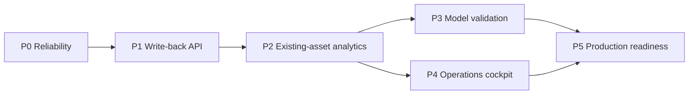
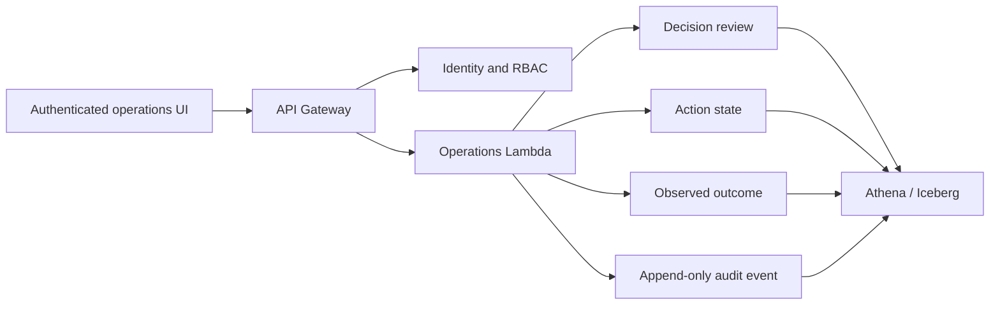

# GLAP Implementation Roadmap

## Purpose

GLAP now has a deployed read-only analytics path: AWS Athena aggregates the
current decision flywheel, GitHub Actions publishes a sanitized OPS contract,
and the product displays stage freshness, operational KPIs, and a seven-day
statistical forecast. The remaining work turns that evidence path into an
authenticated operational system with governed writes and measured feedback.

Public GitHub Pages must remain read-only and aggregate-only. Entity-level
operations, approvals, Actions, and Outcomes belong behind an authenticated
internal boundary.

## Delivery sequence

## P0 — Pipeline reliability and truthful health

**Objective:** make pipeline state dependable before enabling operational
writes.

Deliverables:

- success-gated orchestration rather than schedule timing alone;
- data-quality checks for freshness, completeness, duplicates, and abnormal
  volume changes;
- per-stage start, finish, duration, status, and safe failure category;
- complete CloudWatch, retry, DLQ, and runbook coverage for the current path;
- retirement or isolation of the legacy parallel 08:00 schedules.

Acceptance criteria:

- downstream stages do not run after a failed upstream gate;
- Pages cannot report `current` when any required stage is missing or stale;
- an operator can identify the failed stage and open the correct runbook without
  seeing private AWS identifiers;
- a controlled failure reaches the expected alarm and recovery path.

## P1 — Authenticated operator write-back loop

**Objective:** turn recommendations into governed human decisions and measurable
Actions.

Planned internal flow:

Deliverables:

- versioned API contracts and idempotency keys;
- viewer, operator, approver, and administrator permissions;
- approve/edit/reject workflow with actor, reason, timestamp, and source version;
- controlled Action states, owners, and due dates;
- observed Outcome reconciliation separated from expected impact;
- immutable audit events for every mutation.

Acceptance criteria:

- an authorised operator can review a real decision and record a disposition;
- a retry cannot create a duplicate approval, Action, or Outcome;
- every write can be traced to actor, source decision, request, and resulting
  table version;
- unauthenticated and public Pages clients have no write permission.

## P2 — Governed operational analytics assets

**Objective:** provide stable business metrics by inventorying and reusing the
deployed AWS result tables and views before materialising anything new.

Current reusable assets:

| Existing asset | Primary use |
| --- | --- |
| `fact_shipment_events_extended_iceberg` | Daily volume anchored by `dt` |
| `fact_ai_alerts_v3` | Current alerts and aggregate risk patterns |
| `fact_ai_root_causes_v1` | Existing root-cause results |
| `fact_ai_insights_v3` | Current analysis-stage completion |
| `fact_ai_decisions_v3` | Recommendations and action distribution |
| `fact_ai_actions_v2`, `fact_ai_outcomes_v2` | Execution and measured outcomes |
| `fact_ai_learning_feedback_v1`, `fact_ai_learning_v1` | Feedback and learning state |
| `v_ai_latest_decision_trace` | Existing latest decision trace; depends on `ai_decision_trace_v1` |

All calculation SQL runs in Athena. The public exporter packages only safe
aggregates. A new mart is justified only when this inventory cannot meet a
documented grain, performance, reconciliation, or history requirement.

Acceptance criteria:

- each reused asset has a documented grain and freshness rule;
- dashboard metrics reconcile to existing result-table control totals without
  join fan-out;
- documented SQL reproduces the published KPI within its stated data boundary;
- any proposed new mart includes evidence that no existing asset meets the need.

## P3 — Forecast validation and model upgrade

**Objective:** improve predictions only when evidence shows a candidate beats the
current transparent baseline.

Model ladder:

1. current 28-day ordinary-least-squares baseline;
2. moving-average and recent-level baselines;
3. weekday-seasonal baseline;
4. route/carrier hierarchical baseline inside the private boundary;
5. supervised delay or SLA-risk model after labelled history is sufficient.

Required evaluation:

- rolling time-based backtests with no future-data leakage;
- MAE, RMSE, bias, interval coverage, and MAPE only where actuals are non-zero;
- model-version, feature-contract, training-window, and generation metadata;
- completeness, drift, and prediction-error monitoring;
- explicit fallback to a simple baseline when a candidate is unhealthy.

Acceptance criteria:

- a promoted model consistently beats the benchmark on held-out time windows;
- predictions include bounds and model metadata;
- model failure does not block the operational pipeline or produce a false
  `current` status;
- forecasts remain advisory until a human-owned policy explicitly consumes them.

## P4 — Internal operations cockpit

**Objective:** let an operator move from risk to evidence, review, Action, and
Outcome in one authenticated product journey.

Planned views:

- Today's Operations and Risk Hotspots;
- Decision Queue and review history;
- Action Board with owner, due date, and status;
- Outcome Review with expected-versus-observed values;
- Forecast and Forecast Accuracy;
- Pipeline Health and runbook drill-down.

The public site continues to show only aggregate analytics. Internal views may
show routes, carriers, and entity records according to role permissions.

Acceptance criteria:

- synthetic scenario content, live aggregates, forecasts, and measured outcomes
  are visually and semantically distinct;
- authorised users can drill from an aggregate to its governed evidence;
- loading, empty, stale, partial, and failed states are accessible and tested;
- System remains technical evidence while OPS owns the business flow.

## P5 — Governance and production readiness

**Objective:** make the platform supportable, cost-controlled, and auditable.

Deliverables:

- data classification, redaction, retention, and deletion policies;
- least-privilege IAM and Lake Formation boundaries;
- Athena budgets and cost monitoring;
- Iceberg compaction, snapshot expiration, and orphan-file cleanup;
- API audit logs, lineage, SLOs, dashboards, and incident runbooks;
- backup, recovery, load, concurrency, security, and failure-injection tests.

Acceptance criteria:

- access reviews prove public, analyst, operator, and deployment roles are
  separated;
- restore and incident exercises complete within documented targets;
- cost and reliability thresholds generate actionable alerts;
- evidence always distinguishes synthetic validation from measured production
  impact.

## Recommended next implementation slice

Start with P0. Add a pipeline-run contract and success-gated orchestration, then
publish stage duration and failure state through the existing OPS snapshot. P1
should not accept operational writes until these controls pass a controlled
failure test.
