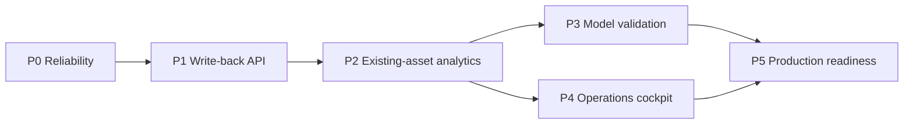
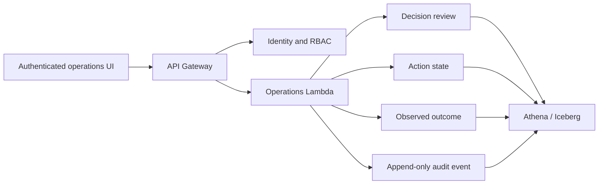

# GLAP Implementation Roadmap

## Purpose

GLAP now has both a deployed public read-only analytics path and a separate
authenticated staging cockpit. AWS Athena supplies governed evidence; the
public product displays sanitized aggregates; authenticated operators can move
from Risk to Decision, Action, Outcome, Pipeline Health, Forecast Accuracy, and
authorised shipment evidence. The remaining work matures actual-calendar
feedback, cost controls, governance, and production readiness.

Public GitHub Pages must remain read-only and aggregate-only. Entity-level
operations, approvals, Actions, and Outcomes belong behind an authenticated
internal boundary.

## Design decision -- 4 August 2026

The next product capability is a stateful synthetic shipment lifecycle. The
same shipment will remain active across logical dates. Port-to-port uses one
immutable ETD and ETA and records ATD/ATA only when observed; Origin gate-in,
destination discharge and final delivery use separate target/actual milestones.
Active updates stop after delivery. See the
[stateful shipment lifecycle design](shipment_lifecycle_design.md) for the
agreed field semantics, Shanghai--Sydney baseline, journey-level delay model,
governance boundary and acceptance criteria.

This design does not replace the current reliability chain. It reuses the six
governed v2 inputs and six current AI outputs, and keeps every business
calculation in AWS. Public Pages remains a sanitized aggregate publisher.

## Implementation checkpoint -- 5 August 2026

The stateful multimodal foundation and its first governed analytics layer are
implemented and validated in isolated AWS staging.

- A 28-day replay carried shipment identities across dates, preserved immutable
  ETD/ETA, stopped active updates after delivery, and passed 448 lifecycle
  checks with 4.58% journey-level exception incidence.
- Maersk and KN operate as Ocean providers and DHL as Air. The first governed
  five-day cohort held Air at 18.07% while preserving common Origin, P2P,
  Destination, and delivery semantics.
- Six read-only analytics views now expose shipment-grain evidence, daily mode
  and provider operations, standardized lane decisions, past-only forecast
  features, and latest outcome labels.
- The isolated controller now runs generation, 19 lifecycle checks, 5 v2
  compatibility checks, and 8 analytics checks. The future-dated synthetic
  `2026-09-07` scenario passed all stages in about 163 seconds; it is technical
  validation, not real September history.
- No recurring schedule, production alias, current-v2 write, or materialized
  daily analytics copy was added.

This completes the data and analytics foundation. It does not constitute a
trained forecasting model or authorize production-boundary changes.

## Forecast-validation checkpoint -- 5 August 2026

The first private AWS forecast validation retained the recent-level baseline
for Maersk after 21 held-out dates. Its MAE was `2.0476`, lower than the moving
average (`2.7279`), OLS (`2.7707`), and weekday-seasonal (`3.6627`) candidates.
DHL Air and KN Ocean each had only six feature dates, so the report remained
`partial_history` and did not manufacture an evaluation result.

Supervised learning remains blocked. Observed outcome counts were 7 for DHL, 0
for KN, and 20 for Maersk, all below the governed 200-label threshold and class
balance rules. Pending outcomes were excluded. Both Athena reads stayed below
one MiB and the workflow published no entity identifiers or public snapshot.

## Future-scenario execution checkpoint -- 6 August 2026

The isolated lifecycle was technically exercised through `2026-10-05` using
future-dated synthetic scenario data relative to `2026-08-06`. Governed
recovery repaired the `2026-10-01` and failed `2026-10-02` scenario snapshots;
the controller then processed `2026-10-03` through `2026-10-05` serially. Every
accepted scenario date passed generation, 19 lifecycle checks, 5 compatibility
checks, and 8 analytics checks. This validates pipeline mechanics, not real
September--October history.

The final private scenario backtest reported complete generated calendars for
DHL Air, KN Ocean, and Maersk Ocean and retained `recent_level` for all three.
Those results validate the evaluation code only. Future-scenario outcomes do not
count as actual observations, real performance, or model-readiness evidence, so
supervised training remains blocked.

No production alias, recurring lifecycle or forecast schedule, current-v2
write, public entity-level artifact, or automatic policy promotion was added.
The full evidence trail and next actions are recorded in
[`development_handoff_2026-08-06.md`](development_handoff_2026-08-06.md).
The operational/simulation boundary is defined in
[`temporal_truthfulness.md`](temporal_truthfulness.md).

## Historical public evidence checkpoint -- 6 August 2026

The repository and public site now apply the temporal boundary end to end.
PRs `#22`--`#25` enforce Sydney-date truthfulness at run, row, query, quality,
and backfill boundaries. PR `#26` adds a ten-check governed operational-calendar
baseline, while PRs `#27` and `#28` publish that baseline without mixing it with
the existing decision flywheel and align every public page to an explicit
evidence class. PR `#29` makes the resulting product readable at normal browser
zoom.

Read-only AWS evidence confirms the `2026-08-06` actual-calendar controller run
passed all six stages and ten checks. Detailed public Pipeline Health is ready
in draft PR `#30`, but it is not merged or live. Its first post-merge Pages run
is the next release gate: the public status remains fail closed until the exact
six-stage and two-gate status object is successfully read and reconciled to the
governed source date.

The calendar still governs learning readiness. Future simulations can exercise
mechanics, but only actual-calendar outcomes accumulated over time may support
operational backtests, supervised training, or production-readiness claims.

## Delivery sequence

## P0 — Pipeline reliability and truthful health

**Objective:** make pipeline state dependable before enabling operational
writes.

Deliverables:

- success-gated orchestration rather than schedule timing alone;
- data-quality checks for freshness, completeness, duplicates, and abnormal
  volume changes;
- per-stage start, finish, duration, status, and safe failure category;
- complete CloudWatch, retry, DLQ, and runbook coverage for the current path;
- retirement or isolation of the legacy parallel 08:00 schedules.

Acceptance criteria:

- downstream stages do not run after a failed upstream gate;
- Pages cannot report `current` when any required stage is missing or stale;
- an operator can identify the failed stage and open the correct runbook without
  seeing private AWS identifiers;
- a controlled failure reaches the expected alarm and recovery path.

## P1 — Authenticated operator write-back loop (implemented in private staging)

**Objective:** turn recommendations into governed human decisions and measurable
Actions.

As of the 7 August handoff, this flow is implemented and verified in private
staging. It is not a production authorisation: production aliases, recurring
schedules, automatic policy activation, supervised-model promotion, and public
entity-level writes remain subject to separate evidence and human approval.

Implemented private-staging flow:

Implemented private-staging capabilities:

- versioned API contracts and idempotency keys;
- viewer, operator, approver, and administrator permissions;
- approve/edit/reject/complete workflow with signed actor, reason, timestamp, and
  immutable source Action state;
- controlled Action transitions, named owners, due dates, and observation dates;
- observed Outcome reconciliation separated from expected impact;
- immutable audit events for every mutation.

Action edit events, an assigned owner, and an Action due date are implemented
and locally verified as an authenticated v1 repository extension. The source
Action stays immutable and edit moves it to `EDITED` for separate approval.
The additive staging schema migration remains plan-only and is not deployed.

Acceptance criteria:

- an authorised operator can review a real decision and record a disposition;
- a retry cannot create a duplicate approval, Action, or Outcome;
- every write can be traced to actor, source decision, request, and resulting
  table version;
- unauthenticated and public Pages clients have no write permission.

## P2 — Governed operational analytics assets

**Objective:** provide stable business metrics by inventorying and reusing the
deployed AWS result tables and views before materialising anything new.

Current reusable assets:

| Existing asset | Primary use |
| --- | --- |
| `simulated_iceberg_m.fact_shipment_v2` | Canonical AI shipment snapshot and public volume target |
| `simulated_iceberg_m.fact_shipment_event_v2` | Shipment milestone events |
| `simulated_iceberg_m.fact_shipment_leg_metrics_core_v2` | Leg duration and SLA evidence |
| `simulated_iceberg_m.fact_shipment_cost_v2` | Shipment cost evidence |
| `simulated_iceberg_m.fact_shipment_risk_v2` | Delay, damage, compliance and overall risk |
| `simulated_iceberg_m.shipment_product_allocation_v2` | Shipment/product allocation |
| `fact_ai_alerts_v3` | Current governed alerts |
| `fact_ai_insights_v3` | Current governed root-cause and evidence layer |
| `fact_ai_decisions_v3` | Current governed recommendations |
| `fact_ai_actions_v2` | Current governed actions and action distribution |
| `fact_ai_outcomes_v2` | Current governed synthetic outcomes |
| `fact_ai_learning_v1` | Current governed learning aggregate |
| `vw_multimodal_shipment_daily_v1` | Reconciled shipment snapshot with common lifecycle metrics and explicit mode units |
| `vw_multimodal_ops_daily_v1` | Daily Air/Ocean operations and SLA performance |
| `vw_multimodal_provider_daily_v1` | Daily DHL, KN, and Maersk provider performance |
| `vw_multimodal_mode_decision_v1` | Advisory lane speed, cost, and risk comparison on standardized simulated weight |
| `vw_multimodal_forecast_feature_daily_v1` | Past-only mode/provider forecasting features with explicit cutoff |
| `vw_multimodal_outcome_label_v1` | Latest observed or pending shipment outcome labels |
| `vw_multimodal_operational_baseline_v1` | Aggregate stateful baseline, evidence boundary, and Control Tower maturity input |

`fact_shipment_events_extended_iceberg`, legacy v1 root-cause and feedback
tables, and the latest-decision trace views may exist in AWS, but they are not
part of the six-input/six-output success-gated public metric contract. The
current exporter references some of these assets and must be corrected in the
P0 metric-contract slice before new lifecycle capability is represented as
current.

All calculation SQL runs in Athena. The public exporter packages only safe
aggregates. A new mart is justified only when this inventory cannot meet a
documented grain, performance, reconciliation, or history requirement.

Acceptance criteria:

- each reused asset has a documented grain and freshness rule;
- dashboard metrics reconcile to existing result-table control totals without
  join fan-out;
- documented SQL reproduces the published KPI within its stated data boundary;
- any proposed new mart includes evidence that no existing asset meets the need.

## P3 — Forecast validation and model upgrade

**Objective:** improve predictions only when evidence shows a candidate beats the
current transparent baseline.

Model ladder:

1. current 28-day ordinary-least-squares baseline;
2. moving-average and recent-level baselines;
3. weekday-seasonal baseline;
4. route/carrier hierarchical baseline inside the private boundary;
5. supervised delay or SLA-risk model after labelled history is sufficient.

Required evaluation:

- rolling time-based backtests with no future-data leakage;
- MAE, RMSE, bias, interval coverage, and MAPE only where actuals are non-zero;
- model-version, feature-contract, training-window, and generation metadata;
- completeness, drift, and prediction-error monitoring;
- explicit fallback to a simple baseline when a candidate is unhealthy.

Acceptance criteria:

- a promoted model consistently beats the benchmark on held-out time windows;
- predictions include bounds and model metadata;
- model failure does not block the operational pipeline or produce a false
  `current` status;
- forecasts remain advisory until a human-owned policy explicitly consumes them.

## P4 — Internal operations cockpit (implemented in private staging)

**Objective:** let an operator move from risk to evidence, review, Action, and
Outcome in one authenticated product journey.

Implemented private-staging views:

- Today's Operations and Risk Hotspots;
- Decision Queue and review history;
- Action Board with current status and governed assign/edit/approve/reject/complete controls
  in the repository; the assignment schema migration is not deployed;
- Outcome Review with expected-versus-observed values;
- Forecast and Forecast Accuracy;
- Pipeline Health and runbook drill-down.

The public site continues to show only aggregate analytics. Internal views may
show routes, carriers, and entity records according to role permissions.

Acceptance criteria:

- synthetic scenario content, live aggregates, forecasts, and measured outcomes
  are visually and semantically distinct;
- authorised users can drill from an aggregate to its governed evidence;
- loading, empty, stale, partial, and failed states are accessible and tested;
- System remains technical evidence while OPS owns the business flow.

Status as of `2026-08-07`: the accessible loading, empty, stale, partial, and
failed-state contract is implemented across the authenticated cockpit. Runtime
API errors can be retried, Pipeline Health freshness and failure states remain
explicit, forecast history limitations are not presented as measured accuracy,
and shipment pagination can preserve previously loaded evidence after a later
page fails. The manual hosting path also verifies that nested JavaScript and CSS
are reachable, so a shell-only HTTP 200 cannot satisfy this acceptance gate.

## P5 — Governance and production readiness

**Objective:** make the platform supportable, cost-controlled, and auditable.

Deliverables:

- data classification, redaction, retention, and deletion policies;
- least-privilege IAM and Lake Formation boundaries;
- Athena budgets and cost monitoring;
- Iceberg compaction, snapshot expiration, and orphan-file cleanup;
- API audit logs, lineage, SLOs, dashboards, and incident runbooks;
- backup, recovery, load, concurrency, security, and failure-injection tests.

Acceptance criteria:

- access reviews prove public, analyst, operator, and deployment roles are
  separated;
- restore and incident exercises complete within documented targets;
- cost and reliability thresholds generate actionable alerts;
- evidence always distinguishes synthetic validation from measured production
  impact.

## Recommended next implementation slices

The authenticated operator journey, reliability exercises, accessible data
states, and staging deployment path are implemented and verified. Work now
splits into an unblocked governance/cost track and a calendar-gated evidence
track.

1. Completed: document grain, owner, source, freshness, and reconciliation
   rules for each remaining internal-only analytics view in
   [`internal_analytics_governance.md`](internal_analytics_governance.md).
2. Completed design: define fail-closed Athena workgroup budgets, baseline-first
   query-cost alarms, and per-view incremental refresh rules. Applying AWS
   controls remains a separately approved infrastructure action.
3. Ready for manual execution: use the actual-calendar evidence runbook for an
   eligible Sydney date, without rewriting history or enabling a schedule.
4. Continue accumulating eligible Outcomes and DHL/KN coverage before repeating
   operational forecast/model-readiness decisions; thresholds remain unchanged.
5. Completed design: classification, retention/deletion, SLO, recovery and
   Iceberg maintenance boundaries are documented. Enforcement, recovery drills,
   and load/security testing remain before any production expansion.
6. Prepared, not deployed: the Action assignment rollout now has an ordered
   schema validation, runtime/role smoke checks, named-human canary, and bounded
   rollback contract. A narrow existing-stack, previous-template change-set RFC
   now limits the candidate release to `ActionMutationFunction`. Its manual,
   read-only plan workflow is implemented and its first run safely identified
   the missing `lambda:GetFunctionConfiguration` permission after OIDC and all
   repository gates passed. The repository owner approved the non-executable
   exact-resource read proposal for named-human application. It is not yet
   applied, the agent cannot modify IAM, and no prepare or execute authority is
   granted; a broad stack update is not an implicit substitute.

Public Pages remains read-only and aggregate-only. Recurring lifecycle or
forecast schedules, production aliases, authenticated writes, and automatic
policy changes require separate review and explicit approval.

## Repository checkpoint -- authenticated staging cockpit, 7 August 2026

The stable Alert, Action, Outcome, and review-only policy contracts now feed a
deployed authenticated staging API and cockpit. Signed identities, role checks,
named-human mutation rules, idempotency, and append-only audit history govern
the write boundary. Public Pages remains separate and read-only.

Actual-calendar eligibility is fail closed: only closed `OPERATIONAL` Outcomes
with `time_basis=ACTUAL_CALENDAR` and an observed date on or before the Sydney
as-of date may enter readiness evidence. Future simulations remain excluded.

Private AWS staging persists governed Alerts, proposed Actions, delayed
Outcomes, review-only policy proposals, and append-only Action audit events.
Risk Hotspots, Decision Queue, Action Board, Outcome Review, Pipeline Health,
Forecast Accuracy, Network Drill-down, and authorised entity evidence are live
behind Cognito. The hosting verifier proves both the HTML shell and its nested
JavaScript/CSS are reachable.

One controlled Action reached `COMPLETED` and produced one `PENDING` Outcome due
`2026-08-09`. It is not observed evidence as of `2026-08-07`. Recurring
execution, production aliases, public entity publication, policy activation,
and model promotion remain outside the approved boundary. See
[`development_handoff_2026-08-07.md`](development_handoff_2026-08-07.md).
