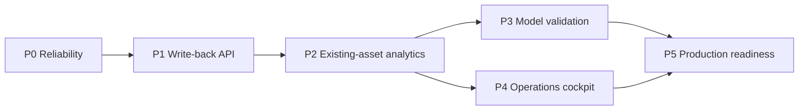
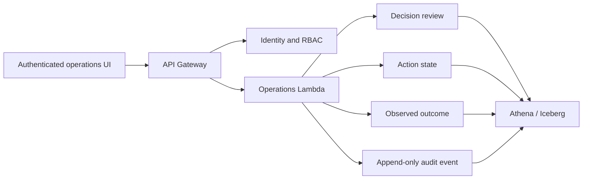

# GLAP Implementation Roadmap

## Purpose

GLAP now has a deployed read-only analytics path: AWS Athena aggregates the
current decision flywheel, GitHub Actions publishes a sanitized OPS contract,
and the product displays stage freshness, operational KPIs, and a seven-day
statistical forecast. The remaining work turns that evidence path into an
authenticated operational system with governed writes and measured feedback.

Public GitHub Pages must remain read-only and aggregate-only. Entity-level
operations, approvals, Actions, and Outcomes belong behind an authenticated
internal boundary.

## Design decision -- 4 August 2026

The next product capability is a stateful synthetic shipment lifecycle. The
same shipment will remain active across logical dates. Port-to-port uses one
immutable ETD and ETA and records ATD/ATA only when observed; Origin gate-in,
destination discharge and final delivery use separate target/actual milestones.
Active updates stop after delivery. See the
[stateful shipment lifecycle design](shipment_lifecycle_design.md) for the
agreed field semantics, Shanghai--Sydney baseline, journey-level delay model,
governance boundary and acceptance criteria.

This design does not replace the current reliability chain. It reuses the six
governed v2 inputs and six current AI outputs, and keeps every business
calculation in AWS. Public Pages remains a sanitized aggregate publisher.

## Implementation checkpoint -- 5 August 2026

The stateful multimodal foundation and its first governed analytics layer are
implemented and validated in isolated AWS staging.

- A 28-day replay carried shipment identities across dates, preserved immutable
  ETD/ETA, stopped active updates after delivery, and passed 448 lifecycle
  checks with 4.58% journey-level exception incidence.
- Maersk and KN operate as Ocean providers and DHL as Air. The first governed
  five-day cohort held Air at 18.07% while preserving common Origin, P2P,
  Destination, and delivery semantics.
- Six read-only analytics views now expose shipment-grain evidence, daily mode
  and provider operations, standardized lane decisions, past-only forecast
  features, and latest outcome labels.
- The isolated controller now runs generation, 19 lifecycle checks, 5 v2
  compatibility checks, and 8 analytics checks. The future-dated synthetic
  `2026-09-07` scenario passed all stages in about 163 seconds; it is technical
  validation, not real September history.
- No recurring schedule, production alias, current-v2 write, or materialized
  daily analytics copy was added.

This completes the data and analytics foundation. It does not constitute a
trained forecasting model or authorize production-boundary changes.

## Forecast-validation checkpoint -- 5 August 2026

The first private AWS forecast validation retained the recent-level baseline
for Maersk after 21 held-out dates. Its MAE was `2.0476`, lower than the moving
average (`2.7279`), OLS (`2.7707`), and weekday-seasonal (`3.6627`) candidates.
DHL Air and KN Ocean each had only six feature dates, so the report remained
`partial_history` and did not manufacture an evaluation result.

Supervised learning remains blocked. Observed outcome counts were 7 for DHL, 0
for KN, and 20 for Maersk, all below the governed 200-label threshold and class
balance rules. Pending outcomes were excluded. Both Athena reads stayed below
one MiB and the workflow published no entity identifiers or public snapshot.

## Future-scenario execution checkpoint -- 6 August 2026

The isolated lifecycle was technically exercised through `2026-10-05` using
future-dated synthetic scenario data relative to `2026-08-06`. Governed
recovery repaired the `2026-10-01` and failed `2026-10-02` scenario snapshots;
the controller then processed `2026-10-03` through `2026-10-05` serially. Every
accepted scenario date passed generation, 19 lifecycle checks, 5 compatibility
checks, and 8 analytics checks. This validates pipeline mechanics, not real
September--October history.

The final private scenario backtest reported complete generated calendars for
DHL Air, KN Ocean, and Maersk Ocean and retained `recent_level` for all three.
Those results validate the evaluation code only. Future-scenario outcomes do not
count as actual observations, real performance, or model-readiness evidence, so
supervised training remains blocked.

No production alias, recurring lifecycle or forecast schedule, current-v2
write, public entity-level artifact, or automatic policy promotion was added.
The full evidence trail and next actions are recorded in
[`development_handoff_2026-08-06.md`](development_handoff_2026-08-06.md).
The operational/simulation boundary is defined in
[`temporal_truthfulness.md`](temporal_truthfulness.md).

## Delivery sequence

## P0 — Pipeline reliability and truthful health

**Objective:** make pipeline state dependable before enabling operational
writes.

Deliverables:

- success-gated orchestration rather than schedule timing alone;
- data-quality checks for freshness, completeness, duplicates, and abnormal
  volume changes;
- per-stage start, finish, duration, status, and safe failure category;
- complete CloudWatch, retry, DLQ, and runbook coverage for the current path;
- retirement or isolation of the legacy parallel 08:00 schedules.

Acceptance criteria:

- downstream stages do not run after a failed upstream gate;
- Pages cannot report `current` when any required stage is missing or stale;
- an operator can identify the failed stage and open the correct runbook without
  seeing private AWS identifiers;
- a controlled failure reaches the expected alarm and recovery path.

## P1 — Authenticated operator write-back loop

**Objective:** turn recommendations into governed human decisions and measurable
Actions.

Planned internal flow:

Deliverables:

- versioned API contracts and idempotency keys;
- viewer, operator, approver, and administrator permissions;
- approve/edit/reject workflow with actor, reason, timestamp, and source version;
- controlled Action states, owners, and due dates;
- observed Outcome reconciliation separated from expected impact;
- immutable audit events for every mutation.

Acceptance criteria:

- an authorised operator can review a real decision and record a disposition;
- a retry cannot create a duplicate approval, Action, or Outcome;
- every write can be traced to actor, source decision, request, and resulting
  table version;
- unauthenticated and public Pages clients have no write permission.

## P2 — Governed operational analytics assets

**Objective:** provide stable business metrics by inventorying and reusing the
deployed AWS result tables and views before materialising anything new.

Current reusable assets:

| Existing asset | Primary use |
| --- | --- |
| `simulated_iceberg_m.fact_shipment_v2` | Canonical AI shipment snapshot and public volume target |
| `simulated_iceberg_m.fact_shipment_event_v2` | Shipment milestone events |
| `simulated_iceberg_m.fact_shipment_leg_metrics_core_v2` | Leg duration and SLA evidence |
| `simulated_iceberg_m.fact_shipment_cost_v2` | Shipment cost evidence |
| `simulated_iceberg_m.fact_shipment_risk_v2` | Delay, damage, compliance and overall risk |
| `simulated_iceberg_m.shipment_product_allocation_v2` | Shipment/product allocation |
| `fact_ai_alerts_v3` | Current governed alerts |
| `fact_ai_insights_v3` | Current governed root-cause and evidence layer |
| `fact_ai_decisions_v3` | Current governed recommendations |
| `fact_ai_actions_v2` | Current governed actions and action distribution |
| `fact_ai_outcomes_v2` | Current governed synthetic outcomes |
| `fact_ai_learning_v1` | Current governed learning aggregate |
| `vw_multimodal_shipment_daily_v1` | Reconciled shipment snapshot with common lifecycle metrics and explicit mode units |
| `vw_multimodal_ops_daily_v1` | Daily Air/Ocean operations and SLA performance |
| `vw_multimodal_provider_daily_v1` | Daily DHL, KN, and Maersk provider performance |
| `vw_multimodal_mode_decision_v1` | Advisory lane speed, cost, and risk comparison on standardized simulated weight |
| `vw_multimodal_forecast_feature_daily_v1` | Past-only mode/provider forecasting features with explicit cutoff |
| `vw_multimodal_outcome_label_v1` | Latest observed or pending shipment outcome labels |

`fact_shipment_events_extended_iceberg`, legacy v1 root-cause and feedback
tables, and the latest-decision trace views may exist in AWS, but they are not
part of the six-input/six-output success-gated public metric contract. The
current exporter references some of these assets and must be corrected in the
P0 metric-contract slice before new lifecycle capability is represented as
current.

All calculation SQL runs in Athena. The public exporter packages only safe
aggregates. A new mart is justified only when this inventory cannot meet a
documented grain, performance, reconciliation, or history requirement.

Acceptance criteria:

- each reused asset has a documented grain and freshness rule;
- dashboard metrics reconcile to existing result-table control totals without
  join fan-out;
- documented SQL reproduces the published KPI within its stated data boundary;
- any proposed new mart includes evidence that no existing asset meets the need.

## P3 — Forecast validation and model upgrade

**Objective:** improve predictions only when evidence shows a candidate beats the
current transparent baseline.

Model ladder:

1. current 28-day ordinary-least-squares baseline;
2. moving-average and recent-level baselines;
3. weekday-seasonal baseline;
4. route/carrier hierarchical baseline inside the private boundary;
5. supervised delay or SLA-risk model after labelled history is sufficient.

Required evaluation:

- rolling time-based backtests with no future-data leakage;
- MAE, RMSE, bias, interval coverage, and MAPE only where actuals are non-zero;
- model-version, feature-contract, training-window, and generation metadata;
- completeness, drift, and prediction-error monitoring;
- explicit fallback to a simple baseline when a candidate is unhealthy.

Acceptance criteria:

- a promoted model consistently beats the benchmark on held-out time windows;
- predictions include bounds and model metadata;
- model failure does not block the operational pipeline or produce a false
  `current` status;
- forecasts remain advisory until a human-owned policy explicitly consumes them.

## P4 — Internal operations cockpit

**Objective:** let an operator move from risk to evidence, review, Action, and
Outcome in one authenticated product journey.

Planned views:

- Today's Operations and Risk Hotspots;
- Decision Queue and review history;
- Action Board with owner, due date, and status;
- Outcome Review with expected-versus-observed values;
- Forecast and Forecast Accuracy;
- Pipeline Health and runbook drill-down.

The public site continues to show only aggregate analytics. Internal views may
show routes, carriers, and entity records according to role permissions.

Acceptance criteria:

- synthetic scenario content, live aggregates, forecasts, and measured outcomes
  are visually and semantically distinct;
- authorised users can drill from an aggregate to its governed evidence;
- loading, empty, stale, partial, and failed states are accessible and tested;
- System remains technical evidence while OPS owns the business flow.

## P5 — Governance and production readiness

**Objective:** make the platform supportable, cost-controlled, and auditable.

Deliverables:

- data classification, redaction, retention, and deletion policies;
- least-privilege IAM and Lake Formation boundaries;
- Athena budgets and cost monitoring;
- Iceberg compaction, snapshot expiration, and orphan-file cleanup;
- API audit logs, lineage, SLOs, dashboards, and incident runbooks;
- backup, recovery, load, concurrency, security, and failure-injection tests.

Acceptance criteria:

- access reviews prove public, analyst, operator, and deployment roles are
  separated;
- restore and incident exercises complete within documented targets;
- cost and reliability thresholds generate actionable alerts;
- evidence always distinguishes synthetic validation from measured production
  impact.

## Recommended next implementation slice

The next implementation slice is forecast validation on the governed feature
and label contracts that now exist in staging.

1. Freeze feature contract version, availability rules, training cutoff, and
   pending-label exclusion behavior.
2. Run rolling time-ordered backtests for recent-level, moving-average,
   weekday-seasonal, and existing OLS booking-volume baselines by mode and
   provider.
3. Compare MAE, RMSE, bias, MAPE where defined, and interval coverage. Keep the
   simplest healthy baseline unless a candidate consistently improves held-out
   windows.
4. Accumulate sufficient observed labels before evaluating supervised SLA,
   delay-risk, or cost-variance candidates.
5. Add completeness, drift, prediction-error, and Athena scan-cost evidence
   before requesting any recurring forecast execution.

Forecasts remain advisory and private. Authenticated production writes,
automatic policy changes, scheduling, and alias promotion remain blocked until
separately reviewed and explicitly approved.
